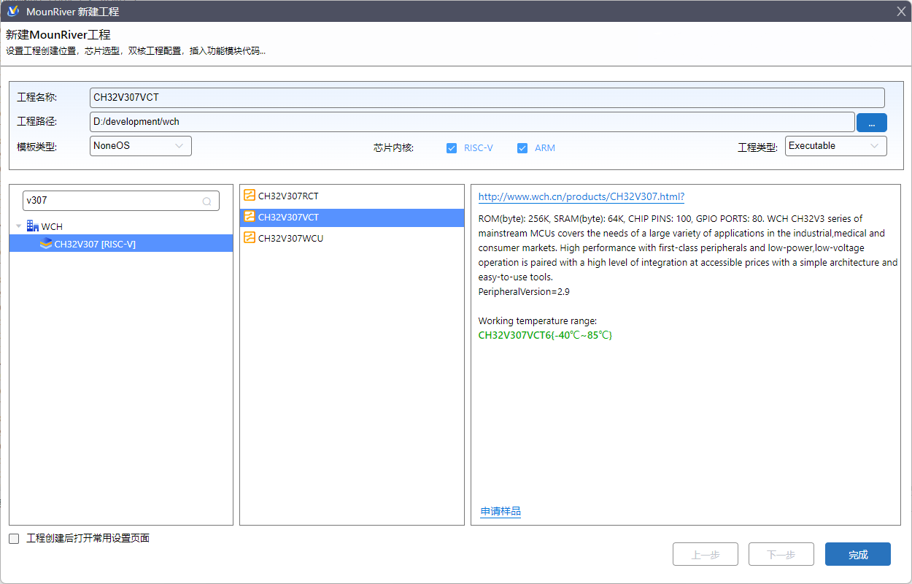
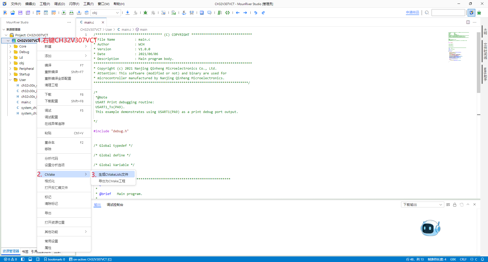
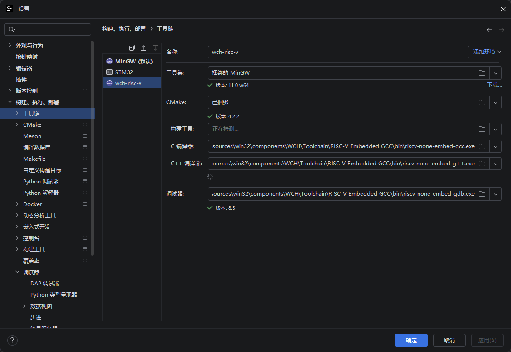
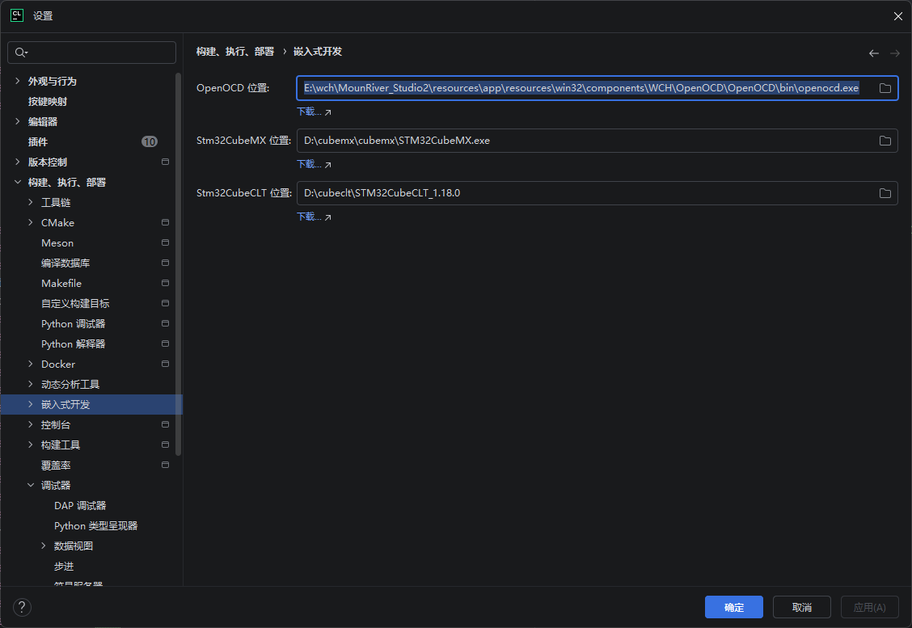
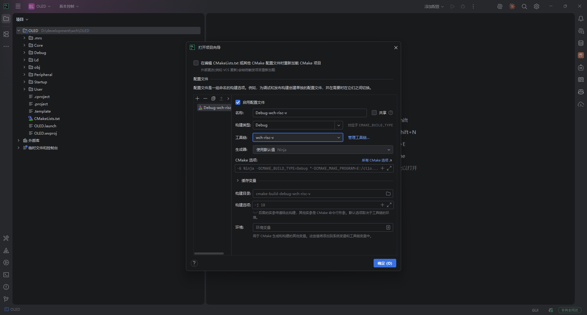
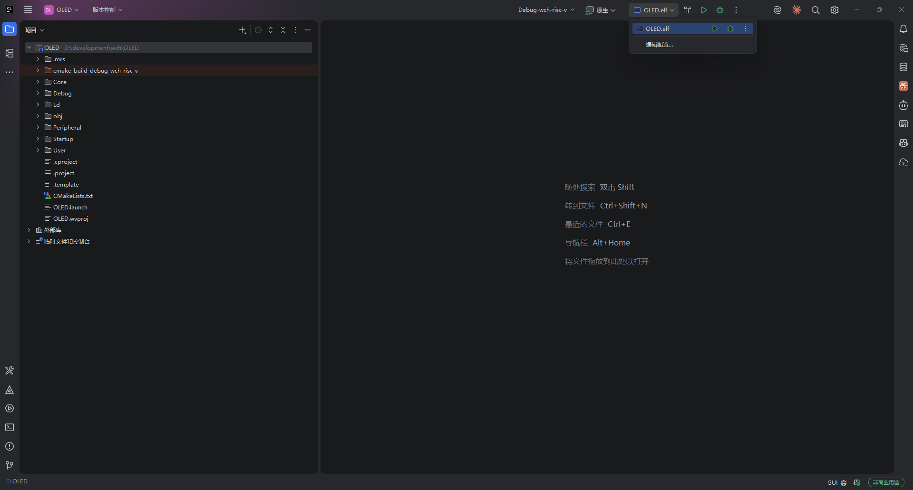
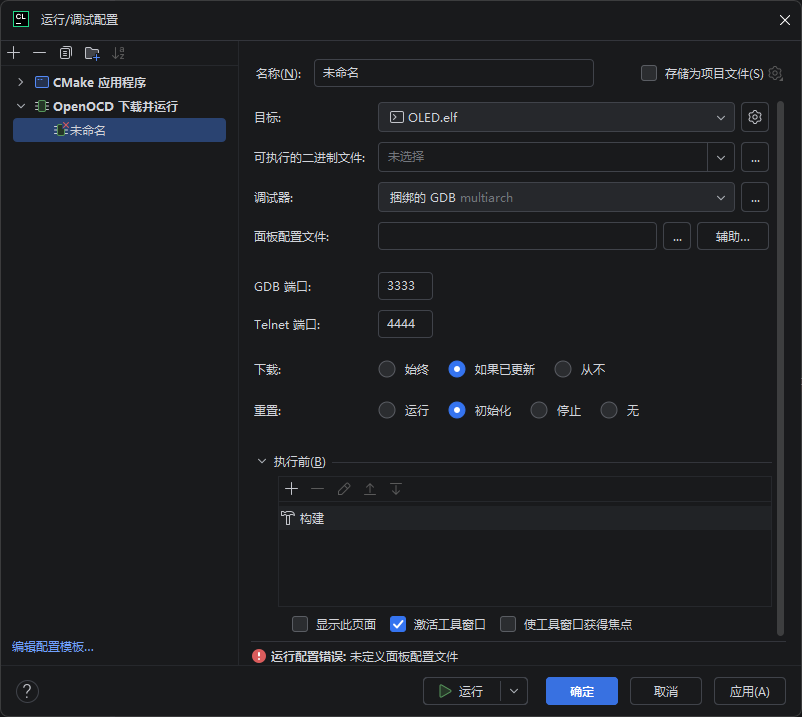
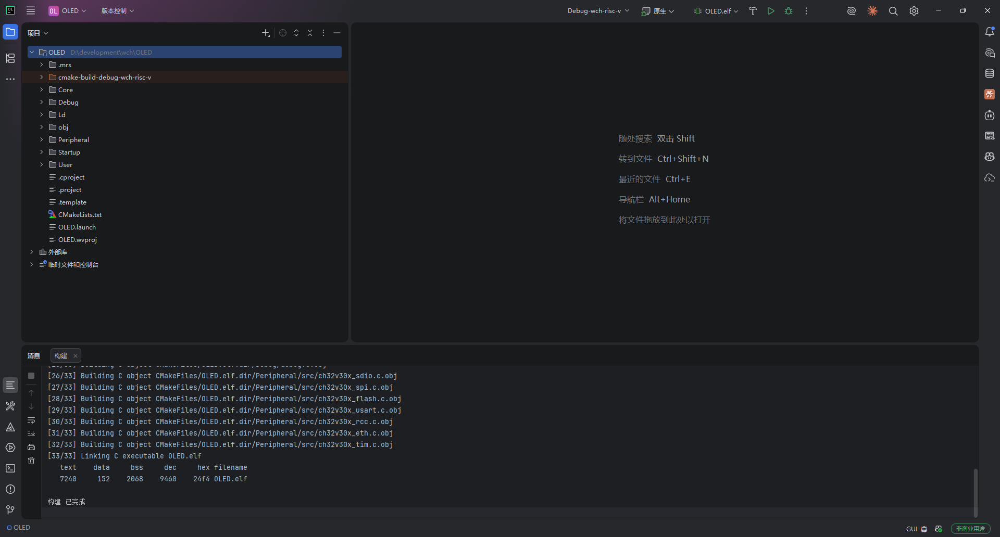
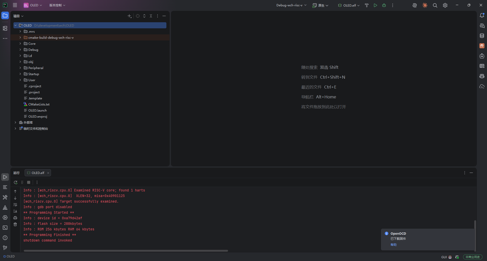
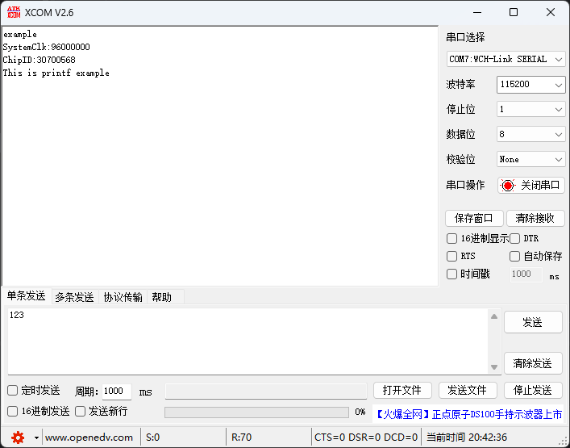

最近通过大学计划从沁恒那边薅了一块 CH32V307VCT6，这几天闲下来准备尝试一下。虽然官方已经提供了基于 VS Code 的 IDE，代码补全之类的也比较完善，但我还是习惯用 CLion 做嵌入式开发，研究了一个晚上，自认为把这套配置跑通了，这里把过程记录下来。

> [!NOTE] 思路
> MounRiver Studio（MRS）本身已经打包好了 RISC-V 的 GCC 工具链和 OpenOCD，所以我们不需要单独去搭工具链，只要**把 MRS 里的工具路径填进 CLion**，剩下的交给 CLion 的 CMake 工程管理即可。

## 下载 MounRiver Studio

程序的编译和烧录需要对应的 GCC 与 OpenOCD，因此要提前下载官方 IDE，后面直接复用其中的工具。

打开下载页：<https://www.mounriver.com/download>


我这里选择的是基于 MRS 2.4.0 的 IDE，下载后按默认流程安装即可。

## 创建工程

打开 IDE，依次点击左上角的 **文件 → 新建 → MounRiver 工程**，芯片搜索 `CH32V307VCT`。



为了演示，这里不添加 RTOS，直接点击创建。

由于 CLion 是基于 CMake 来组织工程文件的，我们还需要在资源管理器中**在工程名上右键**，选择添加 `CMakeLists` 文件。



MRS 这边的任务就差不多结束了，接下来介绍如何在 CLion 中配置。

## 配置 CLion 工具链

打开 CLion 并进入设置，依次点击 **构建、执行、部署 → CMake → 工具链**，新建一个工具链，命名为 `wch-risc-v`（名字随意）。



然后依次设置 GCC、G++ 以及 GDB，这些工具都在 MRS 的安装路径下：

```text
GCC:
MounRiver_Studio2\resources\app\resources\win32\components\WCH\Toolchain\RISC-V Embedded GCC\bin\riscv-none-embed-gcc.exe

G++:
MounRiver_Studio2\resources\app\resources\win32\components\WCH\Toolchain\RISC-V Embedded GCC\bin\riscv-none-embed-g++.exe

GDB:
MounRiver_Studio2\resources\app\resources\win32\components\WCH\OpenOCD\OpenOCD\bin\openocd.exe
```

> [!TIP] 注意工具链架构
> 上面用的是 `RISC-V Embedded GCC`，这是沁恒 RISC-V 架构的工具链。如果换成 ARM 芯片，就要到 `arm-none-eabi` 文件夹里去找对应的工具。

接着在 **设置 → 构建、执行、部署 → 嵌入式开发** 中选择 OpenOCD 调试器，路径如下：

```text
MounRiver_Studio2\resources\app\resources\win32\components\WCH\OpenOCD\OpenOCD\bin\openocd.exe
```



至此，环境搭建基本完成。用 CLion 打开刚才的项目文件看一下：

第一次打开时会提示选择工具链，选择刚才命名好的 `wch-risc-v` 即可。



## 配置运行与调试

我们还需要对运行/调试进行配置。在右上角找到一个蓝色的框框，点击选择 **编辑**。



新建一个 **OpenOCD 下载和运行** 并按下表填写：



| 项目 | 填写内容 |
| --- | --- |
| 可执行的二进制文件 | 与目标同名的 `.elf` 文件 |
| 调试器 | 配置工具链时选择的 GDB 文件 |
| 面板配置文件 | `MounRiver_Studio2\resources\app\resources\win32\components\WCH\OpenOCD\OpenOCD\bin\wch-riscv.cfg` |

设置完成后点击应用、确定。

## 编译与下载

点击小锤子开始编译，出现内存信息就说明编译成功。



点击绿色三角号进行下载：



虽然字体显示为红色，但出现 `** Programming Finished **` 就表示下载成功。

工程创建的时候打开了一个串口发送示例，我们打开串口助手并按下复位键看看效果：



程序成功运行，下载成功。

## 小结

整个流程的核心只有两件事：

1. 用 MRS 生成工程骨架并补上 `CMakeLists.txt`，让 CLion 能接管这个工程；
2. 把 MRS 里的 `riscv-none-embed-gcc` / `g++` / `openocd` 路径填进 CLion 的工具链与嵌入式开发设置里。

配好之后就可以在 CLion 里完成编码、编译、下载和调试，补全、跳转、重构这些体验也都能用上。如果你也在用 CH32V 系列，希望这篇能帮你少走一点弯路。
