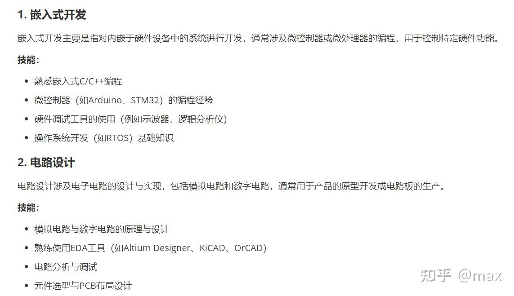
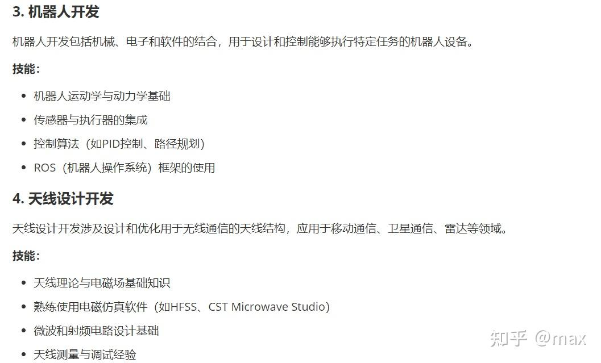
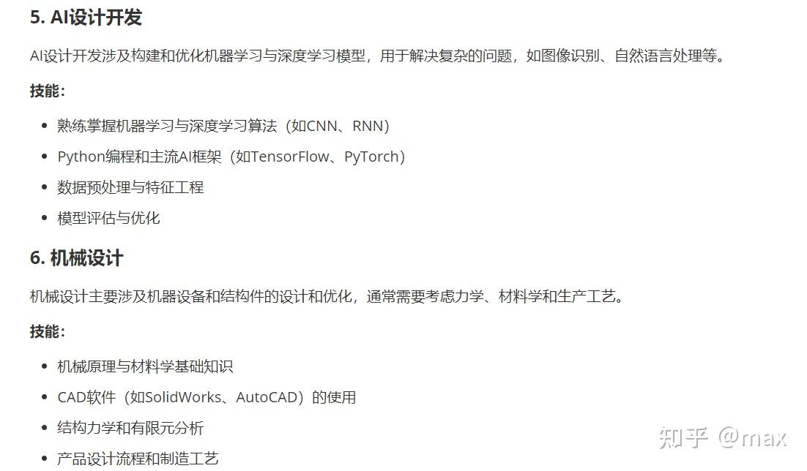
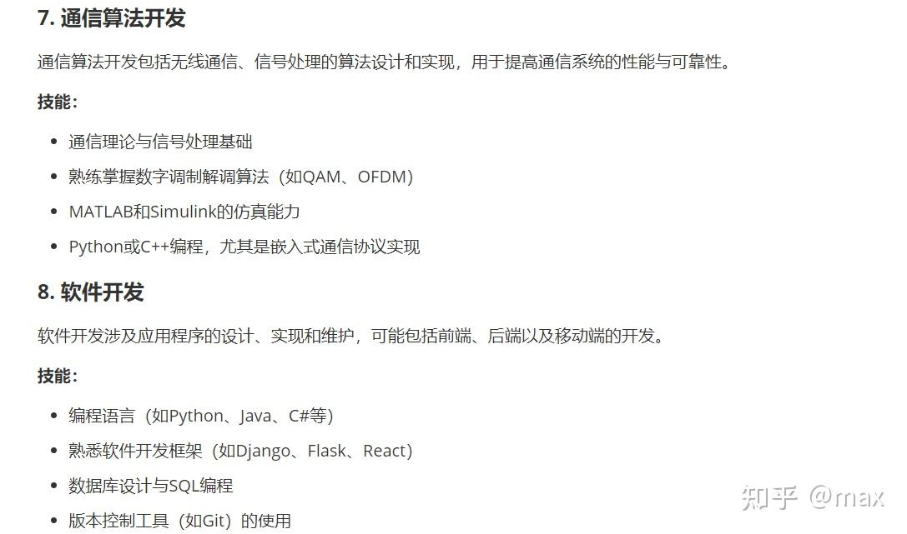
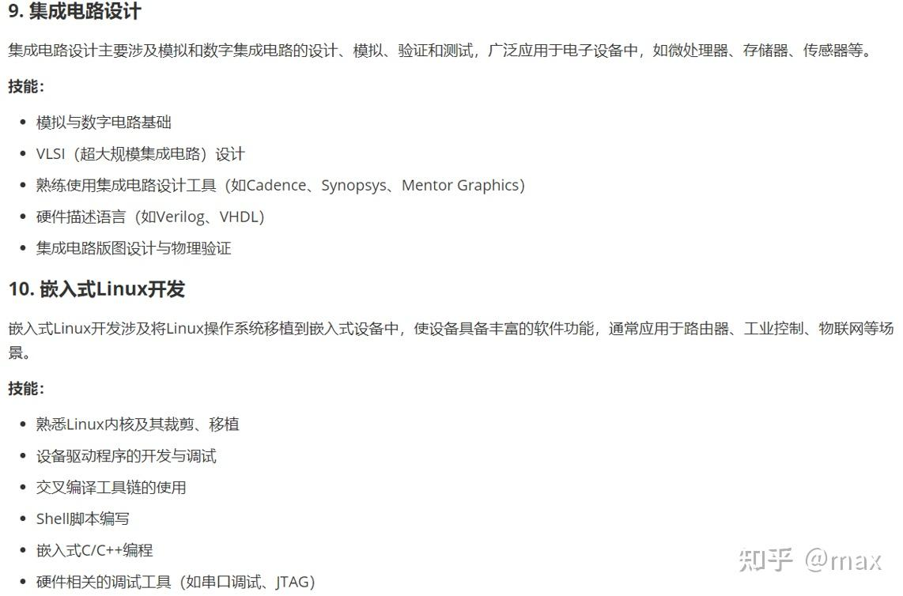
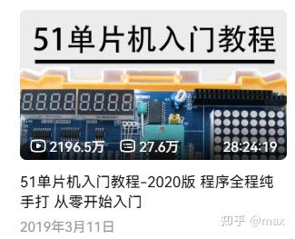
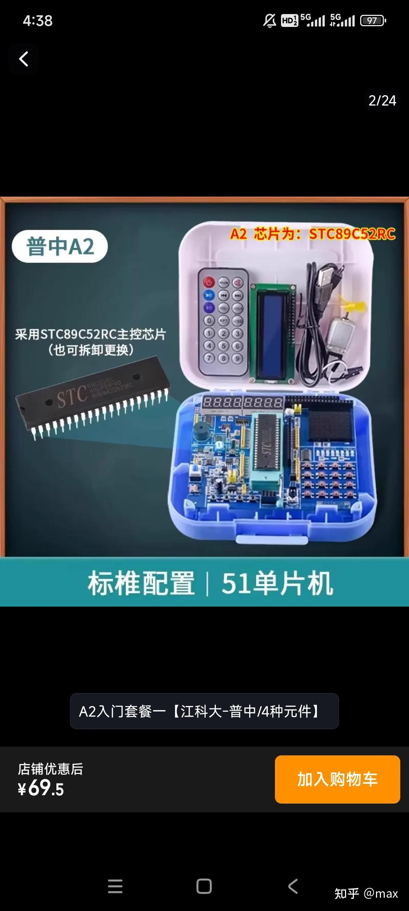
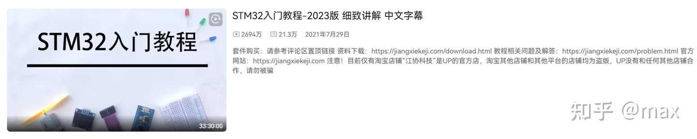

## 前言

由于泥兰的电子类专业实在是一言难尽，完全没有做到对本科生应有的培养，也几乎没有什么人分享到底这门专业应该学什么，怎么学。所以我简单写一篇博客，完全没有使用AI，来谈谈电子信息相关专业的学习路线和建议。

声明：1. 本人文科水平一般，语文水平极差，但是英语水平自认为中上，如有语病，请多包涵。

2\. 文中内容仅代表本人观点，仅供参考！

3\. 文中可能有一些暴论，如果你不同意我的观点，欢迎前来讨论，如果你只是想喷我，建议你直接关闭此文章。

## 目录

1.  泥兰的电子相关专业为什么学科评级低？到底存在什么问题？
2.  电子信息相关专业的学习是什么样的过程？你需要形成哪些思维？
3.  AI究竟对电子这行带来了什么？
4.  电子信息相关专业的学习有哪些方向？
5.  电子信息相关专业具体的学习路线和建议
6.  电子类的竞赛应该怎么打？
7.  个人心态的重要性

## 1.泥兰的电子相关专业为什么学科评级低？到底存在什么问题？

很多新生小登可能不知道，最新的学科评级虽然没有公布，但是据多方打听以及询问学院，你兰的电子信息最新的学科评级没变化，C+，计算机还有个B，至于别的电子相关专业如通信工程、人工智能等，其实和我们电子信息坐一桌。

那么，为什么学科评级低呢？到底有什么问题？笔者一定是希望学科评级好的，否则也不会写这篇博客。要搞清楚这个问题，首先就得知道，学科评级是怎么定的？

学科评级，其实和这门学科学生的技术水平、就业情况没什么关系，看的是学校的科研成果。

说到科研成果，很多人会疑惑，现在不是信息院本科生人均论文起手，大一就能发SCI一区了吗，那怎么还会评级低呢？

老实说，我也不知道。

我唯一知道的是，这个学院(AI院直到今年年中才成立，以前也在信息院)一直处在这样的一个怪圈里：

学生高考进来，分数高，或者我高考失利 -> 我要努力保研 -> 学院在全校保研率极低，不到15%(这里面还有保本校，你要保本校还这么卷干什么，考研考不上吗) -> 我要更卷，必须卷论文卷各类东西加分 -> 老师需要论文来完成他的工作 -> 老师让本科生干活，老师收获了成果、学生收获了加分

我大一那会也没觉得什么，这不是大学正常操作吗？卷了一年，完全卷不过别人，才发现有问题。

人人都想卷，人人都想吃肉，但是肉只有那么可怜的一点点，总有人甚至绝大多数人吃不上，吃不上怎么办？

答案是没人会为你兜底，你的人生只能由你自己决定。

本人其实完全不排斥搞这种学术科研，但是对于那些水平竞争不过别人的人，应该要好好想想你还能干什么？

这个时候你就会发现，考研、就业？太早了。实习？自己啥也不会，地理位置差，学校课天天拉满，没办法逃学的。学习的知识100%都是理论，0实操。最致命的是，也不会有人告诉你你应该怎么做，泥兰也不会为你兜底。

回望整个大一，好像做了很多事，但是其实什么也没做，你所学习的课本知识绝大多数对于找工作没有任何作用，卷的那些东西保不上，那还有什么意义？其实全都是理论自嗨罢了。感觉就像是荒废了一年。

所以泥兰的电子相关专业最大的问题在于学院完全没有为学生兜底的能力甚至说想法，完全没有一点的就业氛围，整个学校不需要全是就业氛围，但是一点的就业氛围没有也太离谱了。老师需要人完成工作，学生需要上这条船，没有人想过学生如果争不到15%，怎么办？学院是既没有争取更多保研名额的能力和想法，也没有提升学科教学水平的能力和想法。

所以笔者下定决心要过自己想要过的生活，再加上笔者是一个自由主义者、现实主义者，也对这门学科有很强的兴趣，在经历一年的学习后，有感而发，打算至少分享一些这门专业到底应该怎么学的想法。

当然，如果你能力很强，边卷成绩和科研，边尽可能地学习必备的技术，那自然是最好了，我也想成为这样，但是对于我来说做不到，但是我相信总有人能做到。

## 2.电子信息相关专业的学习是什么样的过程？你需要形成哪些思维？

好了，不多说这种令人悲伤的话题了，再次声明一下，我是真心热爱这个学校的，没有任何抱怨的意思在里面，希望某些人别应激。新生还是应该要时刻对未来充满希望。

那么，电子信息相关专业的学习是什么样的过程？你需要形成哪些思维？

首先，在我看来，实践的重要性，比课堂学习更甚。

电子信息类专业是实践出真知的典型。课堂上老师讲的电路原理再清晰，不如自己亲手搭一次电路、调一次参数。课本上的代码再规范，不如自己在开发板上烧录一次、解决一次串口通信的丢包问题。学习过程里，你会经历无数次挫败感：画了一周的 PCB 板，打样回来发现引脚接错了；写了几百行的代码，烧录后效果就是有问题。调试了一整天的传感器，数据就是不准确。但这些挫败感的背后，是 “柳暗花明” 的巨大乐趣：当你终于找到 bug 的根源，当你设计的系统第一次稳定运行，当你用自己做的设备实现了预期功能，那种成就感，是任何考试高分都替代不了的。

理论知识有用吗？答案是很有用，但是只是必备的基础，不足以你真正学会这门专业。因为在现实工作里，没有公司会让你去做题，所有工作内容都是十分现实的。这一点和计算机专业有很大不同，因为计算机专业在学习基本专业知识的时候就离不开电脑，但是电子类专业不一样，理论学习电脑用的不多，国内绝大多数学校，这门专业都是看书、做题，但是现在科技发展了，我们需要写代码，我们需要画电路板、3D建模，我们需要解决现实物理世界里的东西，纯靠做题怎么解决问题？

其次，电子信息相关专业的学习是一个极其吃毅力的专业

这门专业大部分方向其实门槛很低，大专生都能比研究生干的好，而且随着AI发展，门槛只会更低。

但是，就正如我前面说的，画了一周的板子，发现引脚接错了，白干，你能接受吗？

写了几天的代码，什么效果都没实现，你能接受吗？

花了不少钱买了一堆物料、开发板，最后板子烧掉了，坏了，你能接受吗？

**答案是你必须接受，费时间费精力0产出这在这行是家常便饭。如果你难以接受，其实我觉得你完全不适合学这行，建议赶紧转行**

泥兰就没有这个格局，有钱，但是0产出的事情是不会干的，干科研肯定不会0产出，这点不如很多双非，不信自己去网上搜搜打智能车和RM比赛的很多都是什么牌子的学校，在动手能力、实操能力、工程解决能力方面不如他们一根，现在这个时代变了，一块学校的牌子分量有，但没那么重，这点我高考结束的时候也没有意识到

你做题的时候有毅力，遇到这种就没有了？

千万不要觉得难过，不多摔倒几次是不会走路的。

再者，学习电子是需要投资的。

这里不是说学习电子，想学好一定要花很多钱，而是，你不可能完全0成本投入得到100的产出，这是不可能的。

比如社团考核代码编写，你总不能手上连50块钱的51单片机开发板都不愿意买吧，你不买，那怎么能够正常学习？纯敲代码不上板验证代码可行性？不去在真实物理世界做一个交互？就算你真的买不起，社团也可以免费借。总而言之，学习电子是需要投资的，无论是投资钱还是时间，不可能不劳而获，这是绝对不可能的。有的人是真觉得宁愿50块吃点好的也一毛不拔，那建议趁早转行。

此外，强烈建议趁早对电子相关的专业产生兴趣。

无论你是想卷学业，还是想搞技术，都强烈建议趁早对这行产生兴趣，找到能让你觉得有意思的地方，否则是真的很有可能学不下去，因为这行我可以说是压抑人群最多的专业，为什么压抑呢？因为真的很难。不是需要高智商的那种难，而是两万五千里长征的那种难。有句话说得好，唯热爱,可抵岁月漫长，唯情怀,可渡人间薄凉。有兴趣在这个专业是一个很强大的支撑，对于搞技术卷保研都很有用。

最后，养成自学能力

很显然绝大部分真正有用的内容学校是不可能教你的，所以你需要自己去网上找教程学习，看不懂就问AI、问同学、看评论区有没有问类似问题的，这种自学能力是极其重要的，因为实际上理论课老师也教不了什么，也得靠学生自学。

那么你需要形成哪些思维？

首先，重实践，不是说理论不学了，而是理论你必须学，但是不能只学理论，这点我不多说了。

其次，要知道这行不容易，轻易放弃那真别学了

再者，要有兴趣，兴趣是最好的老师。

最后，不要还是处于高中思维，死做题，大学不是高中，没有天天考试，没有周考月考，一星期能考两次都不错了，无论学理论还是学技术还是动手实践，都要摆脱这种想法。

## 3.AI究竟对电子这行带来了什么？

冷知识，电子这行大部分方向，可能也就算法、集成电路和具身智能(暂时)门槛高一点，很多本科生水平不见得比大专好，为什么呢？因为这行我实际学下来，要的是脑子灵活能力、变通能力。就比如一个电路图，来比做题，算电路参数，那大专生肯定不如本科生，因为大专生数学计算、物理分析的能力肯定不如本科生。但是来比应用就不好说了，这就像电工，电工没什么学历，但是他经验多啊，他看到电路就知道怎么用，应该这样接那样接，你在那用理论分析了半天，人家凭反应能力就行了。

这个专业很多地方都是这样，只有在实践过程中吃智商的，比如算法、机器人这种，否则门槛确实不高。

虽说门槛不高，但是吃很多苦也是真的，这点别忘了

AI直到去年还水平非常的垃圾，也没有多少人用，直到2026年，情况完全变了，agent的出现彻底改变了这一切，AI可以开始无限制地完整给你干活，这在以前完全不敢想。很多人说计算机已经废了，原因是，AI确实可以全自动完成工作。电子信息说稍微好点，为什么呢？因为电子信息多一步，需要在真实物理世界里验证，计算机是虚拟的，这有本质差别。此外，AI对于硬件的设计是很差的，AI也不可能把焊接这种活干了。

但是，现在这种想法也是错的，因为AI发展太快了，GPT6已经能全自动画板布线，效果不错，至于物理世界的验证，那其实也并不难做到，给装置接一个摄像头，AI用它的多模态功能就能看到真实世界的样子了。

总而言之，AI对于电子信息的冲击不见得比计算机低，只是电子这边很多东西难一点，所以看上去冲击没有那么大。

但是AI发展也是有好处的，以前很多工程闭源，没资料，这两年互联网越来越发达，很多人会在网上分享资料，现在，即使0资料你都可以问AI，完全让AI教你怎么学习，进一步降低了学习的门槛。

所以AI对于电子这行，我的评价是更好学了，但是会更惩罚那些学都不愿意学的人，学的越少经验越少越会被淘汰。

当然如果你是新生，不必担心，毕竟AI今年才这么强，现在开始也不算太晚

## 4.电子信息相关专业的学习有哪些方向？

我把常见的方向总结了一下：有以下几点

1.嵌入式开发 2.硬件电路设计 3. 机器人开发 4.天线设计开发

5\. AI设计开发 6.机械设计 7.通信算法开发 8.软件开发

9.集成电路设计 10.嵌入式Linux开发

这里面相当多的方向是通的，比如本人在1、2、3、5、6、8、10都有学习，尤其是1、2、3、8

方向很多很杂，但是一定在打好基础的情况下对某一或者某几个方向再深入学习，电子这行很难面面俱到，当然你如果是超人自然是最好，但切忌不要学了很多但都学的不精，学的很浅

1、2

3、4

5、6

7、8

9、10

## 5.电子信息相关专业具体的学习路线和建议

方向虽然多，但是绝大部分是融会贯通、触类旁通的，也就是说，我们会一个就相当于会很多。你接触了1再去学习2 3 10等也是会比没有基础的人上手更容易的。

首先，某些理论和技能在我看来是电子信息相关专业必须要会的，不管你搞技术还是卷成绩，这是基本要求，如下：

-   C语言
-   python
-   单片机
-   高等数学
-   线性代数
-   电路分析
-   模拟电路
-   数字电路
-   信号与系统
-   数字信号处理
-   自动控制原理
-   AI工具的使用

当然以下内容也强烈建议学习：

-   简单的微控制器开发(stm32、esp32、mspm0、ch32...)
-   物联网开发
-   MATLAB
-   实时操作系统
-   计算机组成原理
-   机器视觉
-   计算机视觉
-   深度学习
-   强化学习
-   C++
-   数据结构
-   ROS
-   solidworks
-   SLAM
-   linux
-   PCB设计
-   焊接
-   各类通信协议
-   电机开发
-   各类控制算法

能学的内容肯定远远不止这些，我只是稍微列举了一部分，也不是说你一定要全学什么的

本科阶段在本质上还是更倾向于基础和通识，更进一步的深入学习较难在课堂上实现，需要我们在本科阶段自己去探索，去学习。我们需要做的是找到自己喜欢的方向 / 找一个通用的技能（在短期无法确定方向） 入手。我以上述基本都会涉及的嵌入式开发（入门）为例：

你可以按以下内容顺序学习：

软件部分：

1.社团考核(入门内容)

-   C
-   51单片机(如果你调过51直接学stm32也是可以的，建议有能力或者有基础的学生)
-   各类通信协议

2.简单的微控制器开发

-   stm32标准库
-   stm32hal库
-   做一些简单的项目，如多功能菜单、密码锁、万年历、温控风扇等
-   esp32、mspm0、ch32...
-   物联网开发
-   freertos
-   做一个esp32+lvgl+freertos的小终端
-   数据结构
-   嵌入式linux

硬件部分：

-   简单的pcb设计
-   焊接工具的使用
-   示波器、万用表工具的使用
-   电路分析
-   模拟电路
-   数字电路

如果你想要学习视觉和AI入门级别相关的内容，可以按这个顺序：

-   python
-   机器视觉
-   计算机视觉
-   拿openmv、k230模块练习一下，做点小项目
-   深度学习
-   训练并部署模型到开发板上
-   强化学习

具身智能方向，还可以再学习一下ROS、soliworks、机械臂、控制原理、机器人仿真等内容,这里不再阐述

如果你是新生，强烈建议观看如下课程：

C语言---不要买谭浩强那本红书，纯垃圾，建议C primer plus

51单片机入门教程：

<https://www.bilibili.com/video/BV1Mb411e7re/?spm_id_from=333.1387.upload.video_card.click>

传世经典

买一块普中科技的51单片机开发板

标准配置就够用了

社团也提供蓝桥杯的51单片机开发板，二者略有不同但是都是通的，但是你0基础还是建议普中科技的板子，因为有最好的视频教程，可以很容易自学

stm32的教程也可以看他的，看你是否有基础或者能力，如果什么都不会，建议先学完51单片机，再学stm32

<https://www.bilibili.com/video/BV1th411z7sn/?spm_id_from=333.1387.upload.video_card.click>

传世经典

## 6.电子类的竞赛应该怎么打？

首先，认识竞赛

竞赛即比赛，需要展现充分的工程和学科素养进行比拼。比赛分为创新型和工程型的，创新型需要去完成一件完整的的作品，去交给裁判去评选（通常情况是进行答辩+演示），工程型的是去完成一件任务驱动型的作品，会有具体的评分细则 / 获胜条件。我们需要做的是在我们的实验室条件下和结合自身能力去做出好的作品。

1.创新型，如：中国大学生计算机设计大赛 中国机器人及人工智能大赛 中国大学生物联网设计大赛 中国大学生嵌入式芯片与系统设计竞赛等

step.1 对于创新型首先要抓住创新点 因为评委看过非常多的作品（几千件+）所以有一个创新的的立意非常重要，比如别人做小车你也做小车，那肯定不太行。所以需要有一个立意，最好是去解决一个实际的工程问题，并对相关背景进行调研最终决定方向。一个好的创新点是你决胜的关键。

step.2 其次是进行可行性分析，并将你的预期一步步实现。如果你没有特别好的创新点也没有关系，有一个可以解决实际工程问题的想法也是可以的，只要将功能完善即可。

step.3 学会去宣传自己的作品，eg：去做对比实验 对比自己的解决了传统方法 / 别人的方法解决不了的问题；去对比自己和别人的性能指标 速率、效率、功耗等并将他们可视化 绘图出来

step.4 无论做的怎么样，一定要有一个完整的作品，一定要把完整的功能展示出来，你牛皮吹到天上但是作品没做完，那绝对失败。先完赛，然后再想怎么优化创新宣传

2.工程型，如:中国大学生电子设计竞赛 中国大学生工程实践与创新能力大赛 蓝桥杯等

step.1 这类比赛需要极其扎实的功底，同时认可度和含金量也比较高，需要多打磨基本功。一般来讲需要电控、硬件、视觉等知识，同时也需要多人协作一起努力。

\- 电控：嵌入式 & 机器人开发及控制

\- 硬件：电路PCB & 3D结构设计

\- 视觉：机器视觉 & AI算法开发

需要小队内部正确分工以上内容，达到1+1>2的效果。

step.2 多去复现往年的经典题目，多做多问，多参考网上的开源案例和框架。

step.3 尽量的把指标做到满分，如果可以做到满分那可以自己继续加大难度 eg：限时、提高指标难度。

多次训练，多总结开发流程、失败经验，将会对整个的学习过程中有着非常好的提升效果，对于比赛的临场发挥也有着非常大的提升。

其次，找到合适的队友

同专业：最好还是同专业的同学，相对来说对事务理解偏差程度会小一些

肯交流：遇到问题不是一直一个人钻牛角尖，会和队内成员沟通，能够及时更进项目进度，同时推进

性格正常：喜怒无常不太适合队伍管理和沟通，也不要找精致的利己主义者，比赛是一整个团队共同任务

肯学习：不要找思维以自我为中心，不愿学习新技术，新方法的队员，一提到要学什么东西就一拖再拖的队员

当然对于新生来说，其实不用考虑那么多，新生最重要的是团队不能离心离德，队内三人关系要氛围融洽，所以你可以多试错，大一多打一些比赛，找到契合的队友。此外，人要清楚自己什么水平，适合做什么，有的人适合当队长协调团队，有的人适合当主力，不是所有人都适合个人英雄主义，这样容易被反噬。

我大一试错了一年，现在也找到了合适的队友。

最后就是要心态好、有耐心、不要想走捷径

学这行没有任何捷径可走，除非你运气+实力都极强。无论是备赛合还是在比赛过程中都要脚踏实地，不要想着歪门邪道，根据以往的经验，结果都不太好。一步一个脚印，至少结果不会差。

要有耐心，备赛本来就是一个漫长的过程，不要压力自己，更不要压力你的队友，压力毫无作用，更不会改变结果，只会让关系变差。

打比赛打到最后板子烧了，别慌，稳住心态，先看看有没有补救方法。如果真没招了，那就坦然接受吧，就当是一次很有用的经历。千万不要因为这个互相争吵，一个是争吵不会改变结果，二是电子这个东西板子烧了那基本上真的是运气问题或者是团队实力不够，硬件没做好。总而言之，不要在比赛结束之前太在意比赛结果，往往反而结果会很好。

## 7.个人心态的重要性

大学期间活动很多,选择面很广,需要学会拒绝没必要的人和事,更需要牢牢抓住自己的机会。大学期间培养良好的人际关系也很重要:可以拓宽你的视野,说不定有学长学姐推荐你而给你带来更多的机会。当然,最重要的还是自己能坚持,业精于勤荒于嬉。不过也不要太累哦,劳逸结合,多多锻炼,会让自己更有精力,拥有更好的交际能力、学术能力和技术水平。

电子专业学习如此,其他专业大抵也如此,修行还得是靠个人。

送大家几句话:

\----有志者,立长志;

\----不曾开始,永远都不会抵达;

谁的青春不迷茫呢?青春就这么一次。希望大家开心的过每一天,人生不易,且行且珍惜!!!

## 总结

电子是一个大类，专业课涵盖的跨度很大，所以我的建议是所有的基础课+自己决定深入努力学习某个方向。鼓励大家进实验室、社团,我们是工科专业，很看重大家的动手操作能力，即使不进实验室，无论是硬件方面还是软件方面，大家也尽量都有一门精通的编程语言和熟悉的操作软件，有比赛成果和科研经历最好，因为无论找工作还是考研面试还是保研，这都是妥安的加分项。如果条件允许的话,多参加一些比赛积累自己的技术和经验。本科的感觉就是什么都会一点，软件、硬件。但事实上什么都不会，电子信息这个专业一定要学的精。当然最重要的是要学会过日子，心态好、身体健康才是第一！