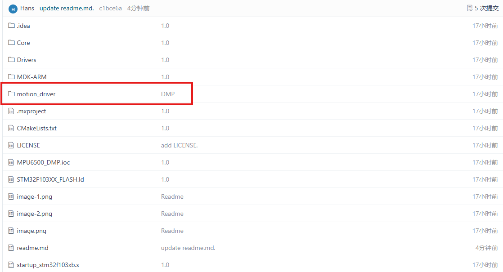
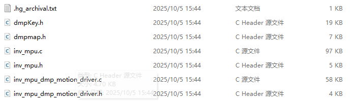
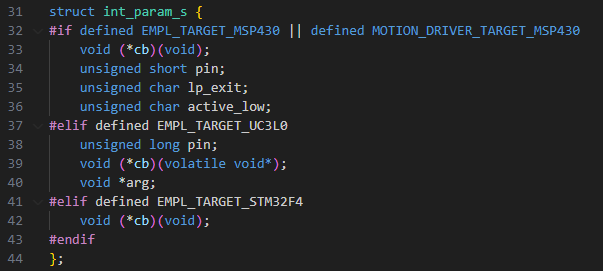
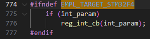
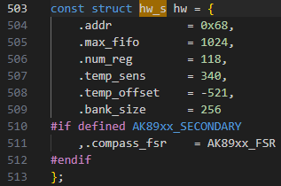
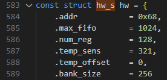
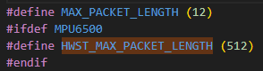
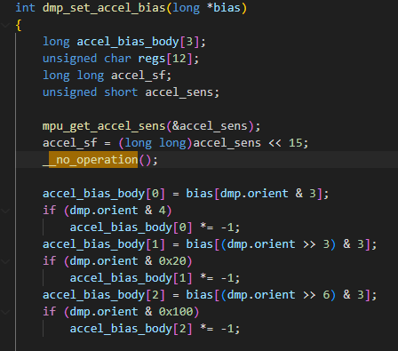
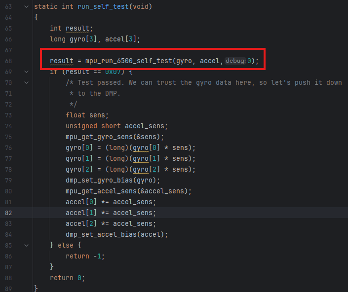
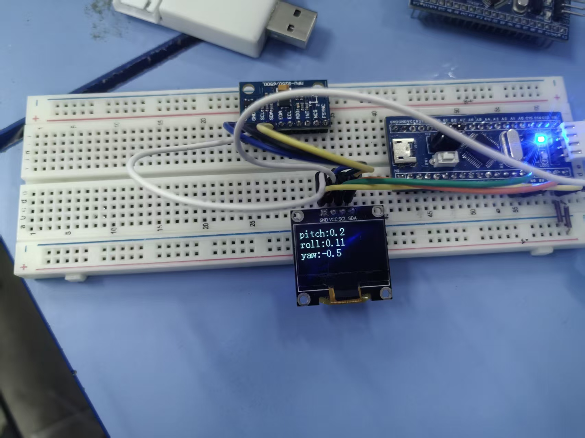

最近查资料发现 MPU6500 的性能要优于 MPU6050，而且目前 MPU6050 芯片已经停产，所以准备把项目里需要陀螺仪的部分全部替换为 MPU6500，于是先尝试一下用 DMP 库做姿态解算。

代码开源地址：<https://gitee.com/Hans_Rudle/mpu6500_dmp>

> [!IMPORTANT] 关键点先说
> DMP 库原版是给 msp430 写的，移植的核心就是**把平台相关的宏定义换成我们自己的实现**（IIC 读写、延时、日志），另外 MPU6500 和 MPU6050 的**自检函数不通用**，这两点决定了移植能不能跑起来。

## 下载 DMP 库

这里使用的是 `motion_driver 6.1`，具体文件可以在仓库里找到。



下载后是这个样子：



把里面的 `.c` / `.h` 文件都添加进自己的工程即可。我这里使用的是 CLion 开发，当然用 Keil 也完全没有问题，接下来就可以开始移植了。

## 移植 DMP 代码

官方提供的是基于 msp430 的工程文件，所以我们要把里面的一些宏定义替换成自己的代码，比如 IIC 读写代码、延时代码。

### inv_mpu.h

首先打开 `inv_mpu.h`，在 31 行的位置有这样的代码：



这段代码主要是为了适应不同开发平台的定义，我们这里不需要，只保留 `void *arg` 部分：

```c
struct int_param_s {
    void *arg;
};
```

### inv_mpu.c

接着打开 `inv_mpu.c`，将 27–161 行全部删除。这段代码的宏定义主要是陀螺仪型号的选择以及一些函数的实现（IIC 读写、延时、调试信息打印），我们将这部分全部替换为自己的代码，具体如下：

```c
#define MPU6500//根据自己的陀螺仪信号进行修改，两者的解算代码是不通用的
#include "main.h"
extern I2C_HandleTypeDef hi2c1;  //注意替换为自己的i2c端口,还有下面的iic写入读取函数
#define i2c_write(dev_addr, reg_addr, data_size, p_data) \
HAL_I2C_Mem_Write(&hi2c1, dev_addr, reg_addr, I2C_MEMADD_SIZE_8BIT, p_data, data_size, 0x100)
#define i2c_read(dev_addr, reg_addr, data_size, p_data) \
HAL_I2C_Mem_Read(&hi2c1, dev_addr, reg_addr, I2C_MEMADD_SIZE_8BIT, p_data, data_size, 0x100)
#define delay_ms HAL_Delay
#define get_ms(p) do{ *p = HAL_GetTick();}while(0)
#define log_i(...) do {} while (0)//我们这里不需要打印调试信息
#define log_e(...) do {} while (0)
/* labs is already defined by TI's toolchain. */
/* fabs is for doubles. fabsf is for floats. */
#define fabs fabsf
#define min(a,b) ((a<b)?a:b)
```

利用 `Ctrl+F` 打开搜索栏，搜索 `EMPL_TARGET_STM32F4`：



删除 `ifndef` 中的代码。

接着 `Ctrl+F` 搜索 `hw_s`，修改器件地址。一共有两个，分别对应 MPU6050 和 MPU6500 所使用的地址，可根据自己的需要修改，将 `.addr` 修改为 `0xd0` 即可。





> [!TIP] 怎么区分这两处
> 看 `.num_reg` 就行：`118` 那组是 MPU6050，`128` 那组是 MPU6500（MPU6500 的寄存器更多）。改你实际用的那颗芯片对应的那一处。

还有一个地方的宏定义需要修改，搜索 `HWST_MAX_PACKET_LENGTH`：



将 `512` 替换为 `1024`，否则之后自检会出现数组溢出导致程序进入 hardfault 卡死。

> [!WARNING] 这一处最容易漏
> `HWST_MAX_PACKET_LENGTH` 不改的话，编译能过、下载也能成功，但一进自检就 hardfault，现象很有迷惑性。

### inv_mpu_dmp_motion_driver.c

接着打开 `inv_mpu_dmp_motion_driver.c`，删除 35–76 行代码，替换为如下代码：

```c
#include "main.h"
extern I2C_HandleTypeDef hi2c1;
#define delay_ms HAL_Delay
#define get_ms(p) do{ *p = HAL_GetTick();}while(0)
#define log_i(...) do {} while (0)
#define log_e(...) do {} while (0)
```

然后利用 `Ctrl+F` 搜索 `_no_operation`：



将 `_no_operation` 替换为 `__NOP();`（`_no_operation` 是 msp430 中使用的，`__NOP()` 才是 STM32 使用的）。

## 验证函数

代码修改完成后，就可以编写初始化代码对 DMP 库进行调用了。这里我参照了别的博主的方法，原视频：<https://www.bilibili.com/video/BV1KaHvesEza/>

但它没法直接用在 MPU6500 上。

在代码 68 行左右的自检函数中，需要根据自己的陀螺仪型号选择合适的自检函数：

- MPU6500 使用 `mpu_run_6500_self_test(gyro, accel, 0);`（`0` 代表不打印调试信息）
- MPU6050 使用 `mpu_run_self_test(gyro, accel)`

需要注意区分：



> [!NOTE] 关于函数命名
> 下面这份代码是从 MPU6050 的例程改过来的，函数名仍然沿用了 `MPU6050_DMP_init` / `MPU6050_DMP_Get_Date`，实际驱动的是 MPU6500。名字不影响运行，介意的话自己重命名一下即可。

### MPU6500.c

```c
#include "MPU6500.h"
#include "inv_mpu.h"
#include "inv_mpu_dmp_motion_driver.h"
#include "math.h"

/* The sensors can be mounted onto the board in any orientation. The mounting
 * matrix seen below tells the MPL how to rotate the raw data from thei
 * driver(s).
 * TODO: The following matrices refer to the configuration on an internal test
 * board at Invensense. If needed, please modify the matrices to match the
 * chip-to-body matrix for your particular set up.
 */
static signed char gyro_orientation[9] = {-1, 0, 0,
                                           0,-1, 0,
                                           0, 0, 1};

/* These next two functions converts the orientation matrix (see
 * gyro_orientation) to a scalar representation for use by the DMP.
 * NOTE: These functions are borrowed from Invensense's MPL.
 */
static unsigned short inv_row_2_scale(const signed char *row)
{
    unsigned short b;

    if (row[0] > 0)
        b = 0;
    else if (row[0] < 0)
        b = 4;
    else if (row[1] > 0)
        b = 1;
    else if (row[1] < 0)
        b = 5;
    else if (row[2] > 0)
        b = 2;
    else if (row[2] < 0)
        b = 6;
    else
        b = 7;      // error
    return b;
}

static unsigned short inv_orientation_matrix_to_scalar(
    const signed char *mtx)
{
    unsigned short scalar;

    /*
       XYZ  010_001_000 Identity Matrix
       XZY  001_010_000
       YXZ  010_000_001
       YZX  000_010_001
       ZXY  001_000_010
       ZYX  000_001_010
     */
    scalar = inv_row_2_scale(mtx);
    scalar |= inv_row_2_scale(mtx + 3) << 3;
    scalar |= inv_row_2_scale(mtx + 6) << 6;


    return scalar;
}

static int run_self_test(void)
{
    int result;
    long gyro[3], accel[3];

    result = mpu_run_6500_self_test(gyro, accel,0);//这里需要根据自己的陀螺仪进行修改
    if (result == 0x07) {
        /* Test passed. We can trust the gyro data here, so let's push it down
         * to the DMP.
         */
        float sens;
        unsigned short accel_sens;
        mpu_get_gyro_sens(&sens);
        gyro[0] = (long)(gyro[0] * sens);
        gyro[1] = (long)(gyro[1] * sens);
        gyro[2] = (long)(gyro[2] * sens);
        dmp_set_gyro_bias(gyro);
        mpu_get_accel_sens(&accel_sens);
        accel[0] *= accel_sens;
        accel[1] *= accel_sens;
        accel[2] *= accel_sens;
        dmp_set_accel_bias(accel);
    } else {
        return -1;
    }
    return 0;
}
int MPU6050_DMP_init(void)
{
    int ret;
    struct int_param_s int_param;
    //mpu_init
    ret = mpu_init(&int_param);
    if(ret != 0)
    {
        return ERROR_MPU_INIT;
    }
    //设置传感器
    ret = mpu_set_sensors(INV_XYZ_GYRO | INV_XYZ_ACCEL);
    if(ret != 0)
    {
        return ERROR_SET_SENSOR;
    }
    //设置fifo
    ret = mpu_configure_fifo(INV_XYZ_GYRO | INV_XYZ_ACCEL);
    if(ret != 0)
    {
        return ERROR_CONFIG_FIFO;
    }
    //设置采样率
    ret = mpu_set_sample_rate(DEFAULT_MPU_HZ);
    if(ret != 0)
    {
        return ERROR_SET_RATE;
    }
    //加载DMP固件
    ret = dmp_load_motion_driver_firmware();
    if(ret != 0)
    {
        return ERROR_LOAD_MOTION_DRIVER;
    }
    //设置陀螺仪方向
    ret = dmp_set_orientation(inv_orientation_matrix_to_scalar(gyro_orientation));
    if(ret != 0)
    {
        return ERROR_SET_ORIENTATION;
    }
    //设置DMP功能
    ret = dmp_enable_feature(DMP_FEATURE_6X_LP_QUAT | DMP_FEATURE_TAP |
            DMP_FEATURE_ANDROID_ORIENT | DMP_FEATURE_SEND_RAW_ACCEL |
            DMP_FEATURE_SEND_CAL_GYRO | DMP_FEATURE_GYRO_CAL);
    if(ret != 0)
    {
        return ERROR_ENABLE_FEATURE;
    }
    //设置输出速率
    ret = dmp_set_fifo_rate(DEFAULT_MPU_HZ);
    if(ret != 0)
    {
        return ERROR_SET_FIFO_RATE;
    }
    //自检
    ret = run_self_test();
    if(ret != 0)
    {
        return ERROR_SELF_TEST;
    }
    //使能DMP
    ret = mpu_set_dmp_state(1);
    if(ret != 0)
    {
        return ERROR_DMP_STATE;
    }
    return 0;
}
//DMP解算的结果为四元数，需要进行换算
int MPU6050_DMP_Get_Date(float *pitch, float *roll, float *yaw)
{
    float q0 = 1.0f, q1 = 0.0f, q2 = 0.0f, q3 = 0.0f;
    short gyro[3];
    short accel[3];
    long quat[4];
    unsigned long timestamp;
    short sensors;
    unsigned char more;
    if(dmp_read_fifo(gyro, accel, quat, &timestamp, &sensors, &more))
    {
        return -1;
    }
    if(sensors & INV_WXYZ_QUAT)
    {
        q0 = quat[0] / Q30;
        q1 = quat[1] / Q30;
        q2 = quat[2] / Q30;
        q3 = quat[3] / Q30;
        *pitch = asin(-2 * q1 * q3 + 2 * q0 * q2) * 57.3; // pitch
        *roll = atan2(2 * q2 * q3 + 2 * q0 * q1, -2 * q1 * q1 - 2 * q2 * q2 + 1) * 57.3; // roll
        *yaw = atan2(2 * (q0 * q3 + q1 * q2), q0 * q0 + q1 * q1 - q2 * q2 - q3 * q3) * 57.3; // yaw
    }
    return 0;
}
```

### MPU6500.h

```c
#ifndef INC_MPU6050_H_
#define INC_MPU6050_H_
 
#define ERROR_MPU_INIT      -1 //错误代码所代表的含义
#define ERROR_SET_SENSOR    -2
#define ERROR_CONFIG_FIFO   -3
#define ERROR_SET_RATE      -4
#define ERROR_LOAD_MOTION_DRIVER    -5
#define ERROR_SET_ORIENTATION       -6
#define ERROR_ENABLE_FEATURE        -7
#define ERROR_SET_FIFO_RATE         -8
#define ERROR_SELF_TEST             -9
#define ERROR_DMP_STATE             -10
 
#define DEFAULT_MPU_HZ  100
#define Q30  1073741824.0f
 
int MPU6050_DMP_init(void);//DMP初始化函数
int MPU6050_DMP_Get_Date(float *pitch, float *roll, float *yaw);//DMP调用函数
 
#endif /* INC_MPU6050_H_ */
```

## 主函数验证

调用函数写完后，就可以在主函数中进行验证了。我这里用 OLED 打印解算结果（使用 CLion 的记得打开浮点数打印支持，仓库里有具体说明）。

下面是按我自己的 OLED 代码调用的写法，作为参考，你可以根据自己的喜好替换为串口打印或别的方式：

```c
/* USER CODE BEGIN 2 */
  HAL_GPIO_WritePin(GPIOC,GPIO_PIN_13,GPIO_PIN_SET);
  OLED_Init();
  OLED_Clear();
  int ret=0;
  do {
    ret=MPU6050_DMP_init();//DMP初始化
  } while (ret);
  /* USER CODE END 2 */

  /* Infinite loop */
  /* USER CODE BEGIN WHILE */
  while (1)
  {
    /* USER CODE END WHILE */

    /* USER CODE BEGIN 3 */
    MPU6050_DMP_Get_Date(&pitch,&roll,&yaw);//DMP数据获取
    sprintf(String,"pitch:%.1f",pitch);
    OLED_ShowString(0,0,String,8);
    sprintf(String,"roll:%.1f",roll);
    OLED_ShowString(0,16,String,8);
    sprintf(String,"yaw:%.1f",yaw);
    OLED_ShowString(0,32,String,8);
    OLED_Update();
  }
  /* USER CODE END 3 */
```

## 实验现象

### 接线

我所有的 IIC 设备都挂在 `hi2c1` 下面，直接串接即可：

| 传感器 | MCU |
| --- | --- |
| 3V3 | 3V3 |
| PB6 | SCL |
| PB7 | SDA |
| GND | GND |

### 现象



OLED 上稳定输出三个姿态角，说明 DMP 已经正常工作。

## 踩坑小结

移植过程中真正花时间的其实就这几处，整理一下方便对照排查：

| 位置 | 改动 | 不改的后果 |
| --- | --- | --- |
| `inv_mpu.h` | `int_param_s` 只保留 `void *arg` | 平台相关结构体编译不过 |
| `inv_mpu.c` | 27–161 行宏定义换成自己的 IIC / 延时 / 日志 | 找不到 msp430 的平台实现 |
| `inv_mpu.c` | `hw_s` 中器件地址改为 `0xd0` | 读不到传感器 |
| `inv_mpu.c` | `HWST_MAX_PACKET_LENGTH` 512 → 1024 | 自检数组溢出，进 hardfault 卡死 |
| `inv_mpu_dmp_motion_driver.c` | 35–76 行换成自己的头文件与宏 | 同上 |
| `inv_mpu_dmp_motion_driver.c` | `_no_operation` → `__NOP();` | 编译报错 |
| 自检函数 | MPU6500 用 `mpu_run_6500_self_test(gyro, accel, 0)` | 自检不通过，初始化返回错误码 |

如果你也在把 MPU6050 换成 MPU6500，希望这篇能帮你少踩几个坑。代码已经开源在 <https://gitee.com/Hans_Rudle/mpu6500_dmp>，有问题欢迎交流。
