最近自制了一块 MSPM0G3519，并已开源：

- 开源硬件：[MSPM0G3519 - 立创开源硬件平台](https://oshwhub.com/max1337/project_qmugwynn?jspm=hub.zy.zp.gc1___hub.ex.zp&jlc_vid=T1laVwZRR1RYUABSFAVcVlNeT1dWUVIDFlgNBAJREVkxVlNeTllcVV1QRFFXVDtWKA4dDxMOAgNABAsL)
- 代码工程与软硬件资料：[mspm0_example：mspm0 系列单片机资料、自己写的示例工程](https://gitcode.com/cyea/mspm0_example)

此仓库是我写的代码工程以及软硬件资料，开发的时候可以参考；也记得给社团仓库点点关注，谢谢！

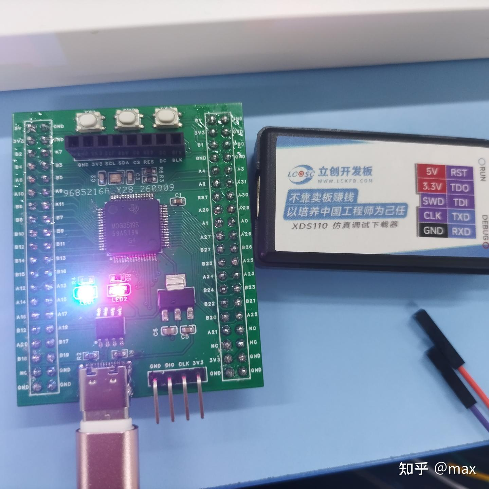

TI（德州仪器）的 MSPM0 系列单片机里最经典的就是 MSPM0G3507，但是其性能一般，甚至只有一个编码器，这对使用 MSPM0G3507 作为主控的控制类问题很不友好——一般都要使用 2 个以上的编码器。所以在 MSPM0G3507 上，我们常用外部中断（EXTI）读取正交编码器的值，这显然不如定时器编码器模式来得精确、代码也更牢靠。此外 MSPM0G3519 的外设资源也全面优于 MSPM0G3507，甚至 MSPM0G3507 的所有资源引脚在 MSPM0G3519 上依旧是一一对应的，完全一样。综上所述，**MSPM0G3519 是 MSPM0G3507 完全的上位替代**。

由于 MSPM0G3519 芯片比较新，资料也不多，下面来介绍一下 MSPM0G3519 的开发经验。

## 开发软件环境

我推荐 CCS / CCS Theia / VS Code，我使用的是 **CCS Theia + 桌面端 AI 辅助**。

## 程序下载方式

1. XDS110（强烈建议）
2. J-link（拉完了）
3. 串口（不到万不得已不用）

烧录的时候强烈建议使用 **XDS110**，可以去立创商城买一个，85，质量很好；淘宝很有可能买到假货。极其不建议使用串口和 J-link 烧录：前者会有各种玄学，可能进不去 BSL 模式从而无法烧录；后者由于芯片较新，盗版的便宜 J-link 驱动太老，无法烧录，而正版的 J-link 比 XDS110 贵得多，而且 TI 官方对 XDS110 的支持也是最好的。

XDS110 买到后记得要装驱动固件，这里直接让 AI 帮你干即可，几分钟搞定。

## 工程配置（CCS Theia）

右键工程，很容易看到编译和 debug 选项，这里不再阐述：

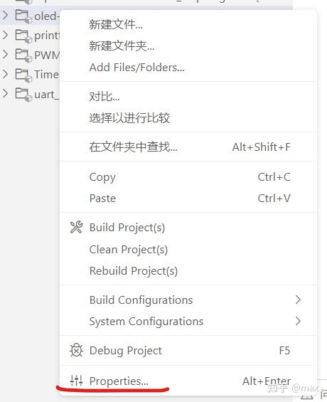

点击 Properties。

按以下图片配置：

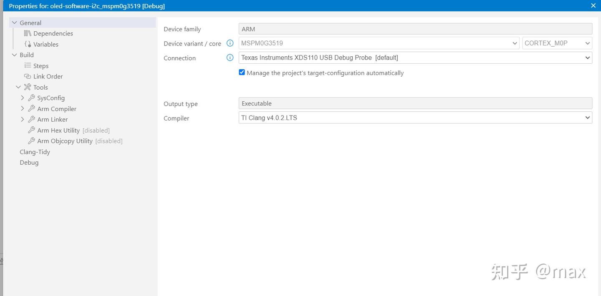

选 XDS110 USB。

工程如果一直有感叹号，可在此手动选依赖版本消除此问题：

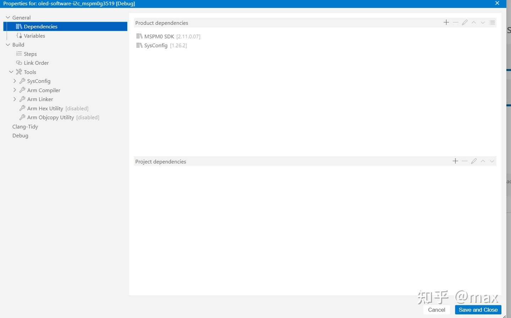

更改包含的文件路径，注意这里都是基于 `${PROJECT_ROOT}` 的相对路径，用于工程文件模块化管理：

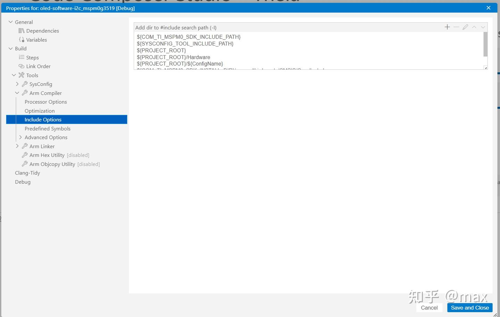

这个地方填 0，不要编译器优化，防止把一些变量优化掉；变量前全部加 `volatile` 也可以解决此问题，双重保险建议都做：

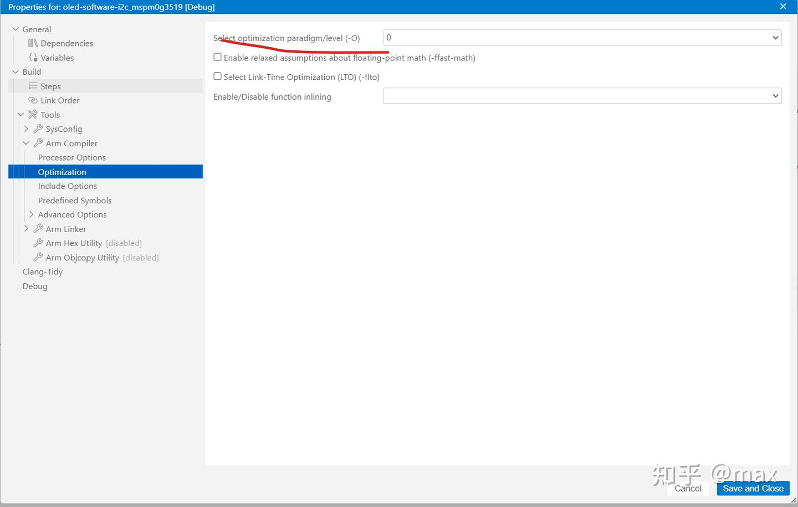

勾选这个：

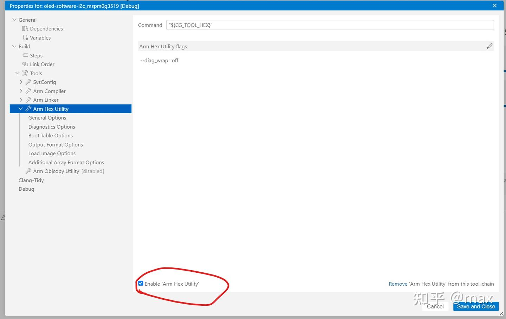

可以选择文件输出格式。

我们一般默认不用更改编译出来的文件格式，默认选择 `.out` 文件，在 CCS 里 debug 同时并烧录。

如果你要用串口下载程序，就要照着图片里选择 `.hex` / `.txt` 的编译生成文件格式，两个都行：

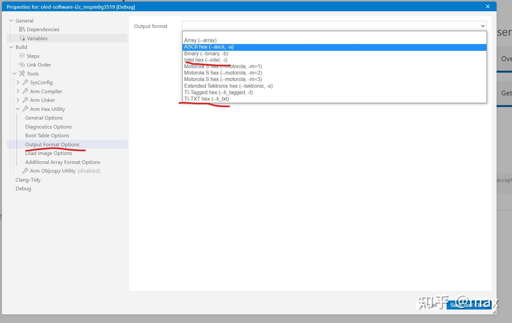

进入通用设置：

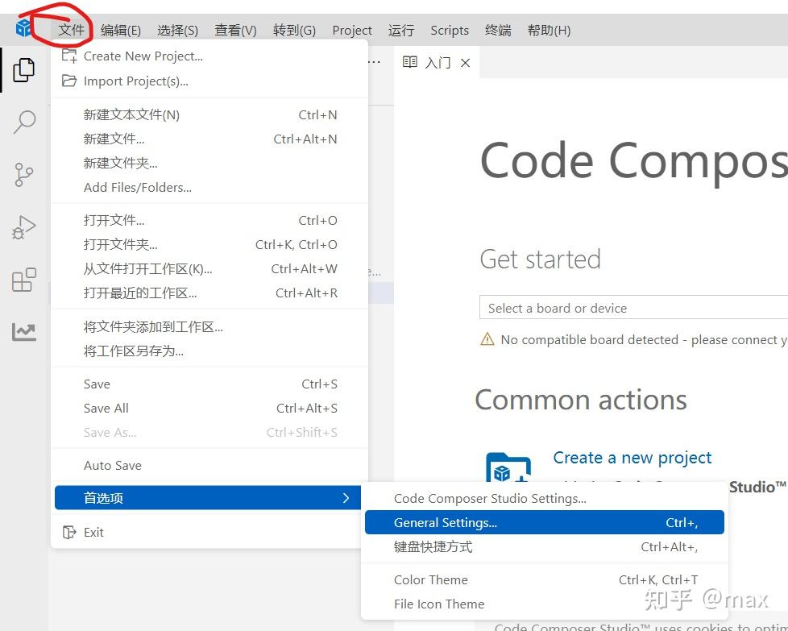

添加 `--header-insertion=never` 变量：

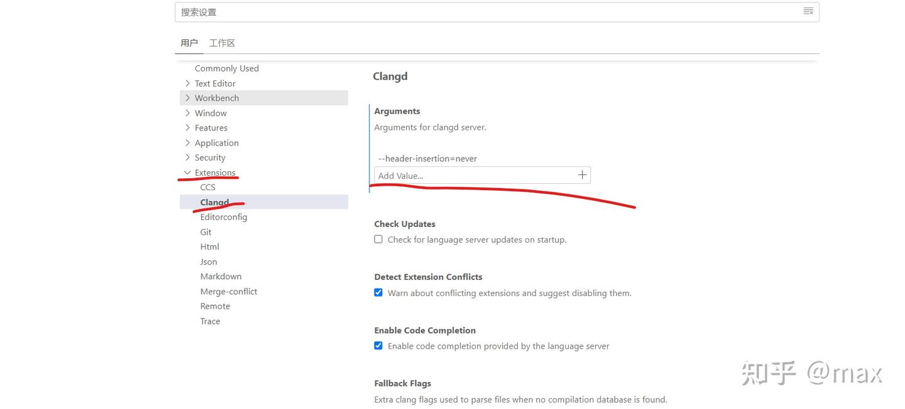

`--header-insertion=never`，添加此变量可以有效防止在敲代码自动补全的时候生成额外的头文件，从而导致可能的编译失败。

至于外设配置、函数使用，和 MSPM0G3507 完全一样，可自行找 B 站教程，我推荐这个：

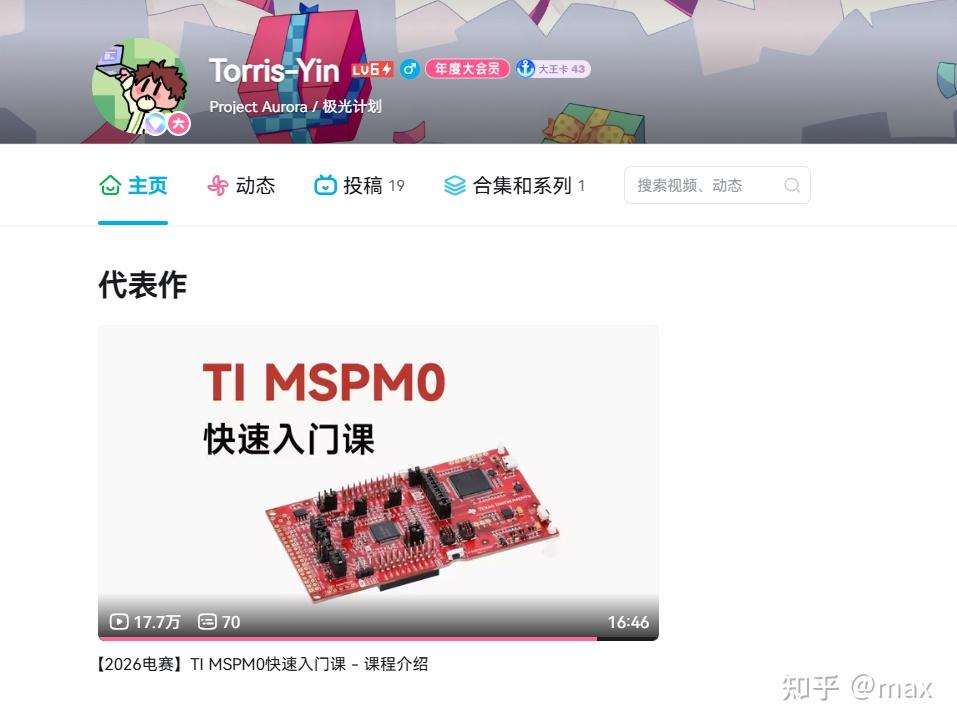

讲的还可以。

## 锁板解决方法

TI 的芯片都做得相当神，经常会因为使用不当导致锁芯片，就是无法再向芯片中下载程序。

首先，使用不当的下载器会导致锁板，尤其是盗版、驱动老的 J-link。因为 MSPM0G3519 芯片比较新，J-link 本来的新固件也 bug 多，所以生态支持极差，而其它两种方式一般没有问题。

经过我几天的开发，我也遇到过锁芯片，但基本上都是相同的问题造成的——**时钟树配置不当**。

经我的不断尝试，无论你是选择倍频 SYSOSC（32MHz）还是使用外部晶振（40MHz）倍频，让 CPU 主频工作在 80MHz，板子下载成功一次程序后就直接锁了，再也下载不了程序；或者就是芯片没锁，但是掉电就丢失。我问了 AI、查阅手册，暂时也不知道是什么问题，不知道是 TI 的芯片问题、还是我板子硬件设计问题、还是我配置的问题。

总而言之，**建议不要碰时钟树，直接默认即可**，32MHz 也够用了：80MHz 主频分到定时器也就 40MHz，但是使用 SYSOSC 默认的 32MHz，定时器也是 32MHz，二者相差无几。

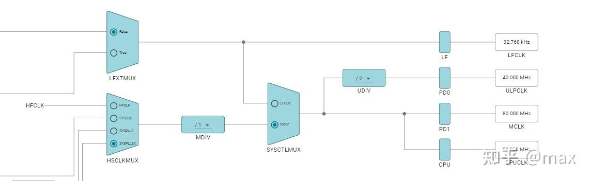

**不要使用这种 80MHz 配置！！！**

那么芯片被锁了怎么解决呢？以下方法不一定有效，不一定涵盖各种锁板的报错情况，但不管你是 XDS110 还是 J-link，一定有用，值得尝试。

我芯片被锁的报错：

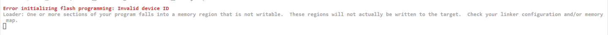

非常抽象。

### 方法一：用 UniFlash 整片擦除

去德州仪器官网搜索 uniflash 软件并下载，我下的是 9.6.0。

然后如下图配置：

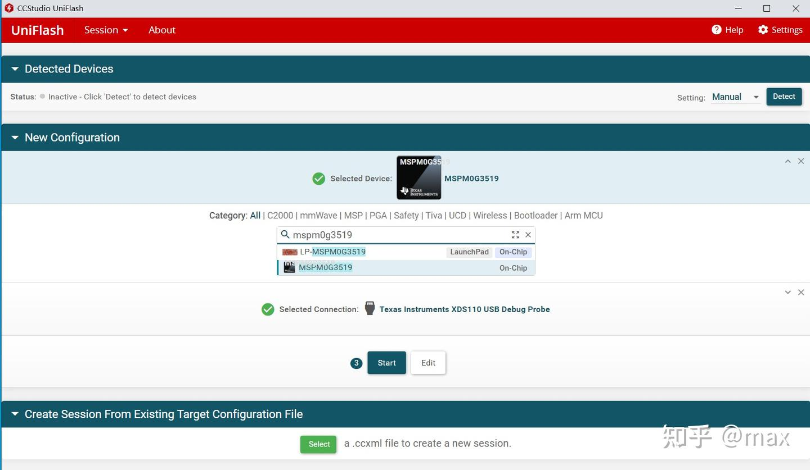

选择芯片。

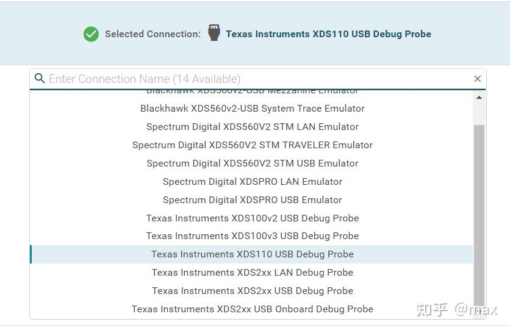

选择下载器。

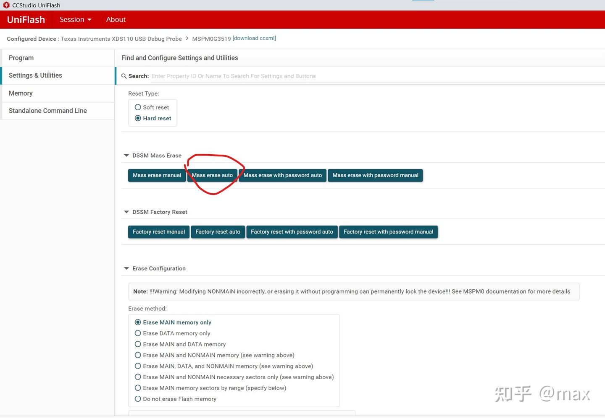

点击这个按钮（Mass erase auto）。

然后会弹出界面，等待到弹出此界面：

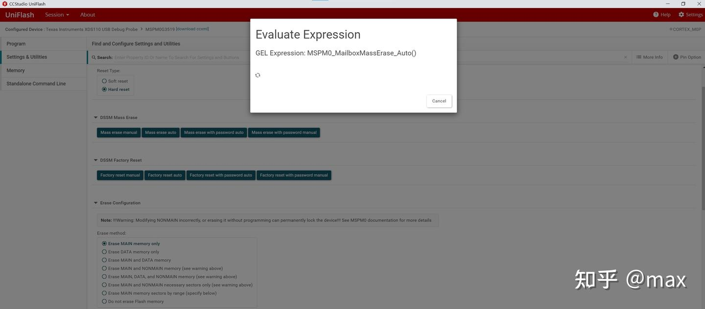

卡在执行这一句。

然后再等个半分钟左右，按下板子上的 reset 键。

日志打印这个就说明成功了：

```text
[2026/9/19 下午7:44:15] [INFO] CS_DAP_0: GEL Output: Initiating Device Mass Erase
[2026/9/19 下午7:44:15] [INFO] CS_DAP_0: GEL Output: Attempting CS_DAP connection
[2026/9/19 下午7:44:16] [INFO] CS_DAP_0: GEL Output: Attempting SEC_AP connection
[2026/9/19 下午7:44:16] [INFO] CS_DAP_0: GEL Output: Command Sent
[2026/9/19 下午7:44:17] [INFO] CS_DAP_0: GEL Output: Start hardware Reset using NRST
[2026/9/19 下午7:44:17] [INFO] CS_DAP_0: GEL Output: Initiating BOOTRST Board Reset
[2026/9/19 下午7:44:17] [INFO] CS_DAP_0: GEL Output: Reset line asserted
[2026/9/19 下午7:44:17] [INFO] CS_DAP_0: GEL Output: Reset line de-asserted
[2026/9/19 下午7:44:17] [INFO] CS_DAP_0: GEL Output: Board Reset Complete
[2026/9/19 下午7:44:17] [INFO] CS_DAP_0: GEL Output: Reset done
[2026/9/19 下午7:44:17] [INFO] CS_DAP_0: GEL Output: SEC_AP Disconnect
[2026/9/19 下午7:44:17] [INFO] CS_DAP_0: GEL Output: SEC_AP Reconnect
[2026/9/19 下午7:44:54] [INFO] CS_DAP_0: GEL Output: Command execution completed.
[2026/9/19 下午7:44:54] [INFO] CORTEX_M0P: GEL Output: Mass Erase executed. Please terminate debug session, power-cycle and restart debug session
```

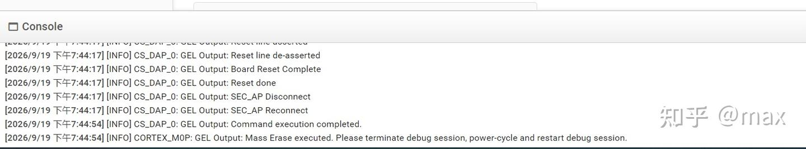

如果不行，再点击这个按钮，同样的等到执行到某一命令不动的时候等一会按复位：

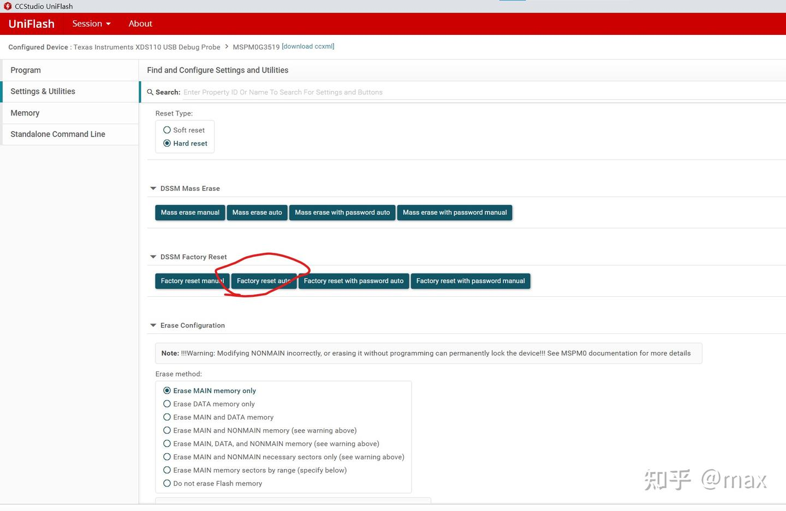

注意底下的其它配置**绝对不要动**！

成功后一定要关闭软件，然后就可以重新烧录代码了，但是注意**主频改回 32MHz**！

### 方法二：兜底的串口 BSL 烧录

如果以上方法均失败，可以使用压箱底的串口烧录。

首先，这样连接：

| CH340 | MCU |
| --- | --- |
| TXD | PA11（BSL RX） |
| RXD | PA10（BSL TX） |

然后打开嘉立创的串口在线烧录工具：[MSPM0 串口烧录工具](https://wiki.lckfb.com/storage/html/mspm0-web-flasher/index.html)。选择好端口号（看设备管理器端口号），连接上串口，选择电脑里编译出来的 `.txt` / `.hex` 文件（编译方法前文讲了）。

然后按住 BSL 按键不动（PA18 = 3.3V），按一下复位键，松开复位键，然后松开 BSL 按键，此时芯片进入了 BSL 模式。

**10s 内，一定要点击烧录**，这样就可以解锁了！

如果不行多试几次即可。这是此工具的文档：[MSPM0 串口在线烧录工具 | 立创开发板技术文档中心](https://wiki.lckfb.com/zh-hans/web-tool/mspm0-web-flasher/introduce.html)。

## 小结

- 选型上，MSPM0G3519 是 MSPM0G3507 的上位替代，引脚一一对应，外设资源更充足；
- 下载器优先用 **XDS110**，串口和 J-link 都容易踩坑；
- CCS Theia 工程配置记住几个关键点：依赖版本手动选、包含路径用 `${PROJECT_ROOT}`、优化等级填 0、需要串口烧录时勾选 Arm Hex Utility 并输出 `.hex`/`.txt`、Clangd 加 `--header-insertion=never`；
- **不要随便动时钟树**，默认 32MHz 就够用，配 80MHz 很可能直接把芯片锁了；
- 万一锁板，先试 UniFlash 的 Mass erase auto / Factory reset auto，再不行用串口 BSL 烧录兜底。

代码工程与软硬件资料都在 [mspm0_example](https://gitcode.com/cyea/mspm0_example)，欢迎参考，也记得给社团仓库点点关注！
