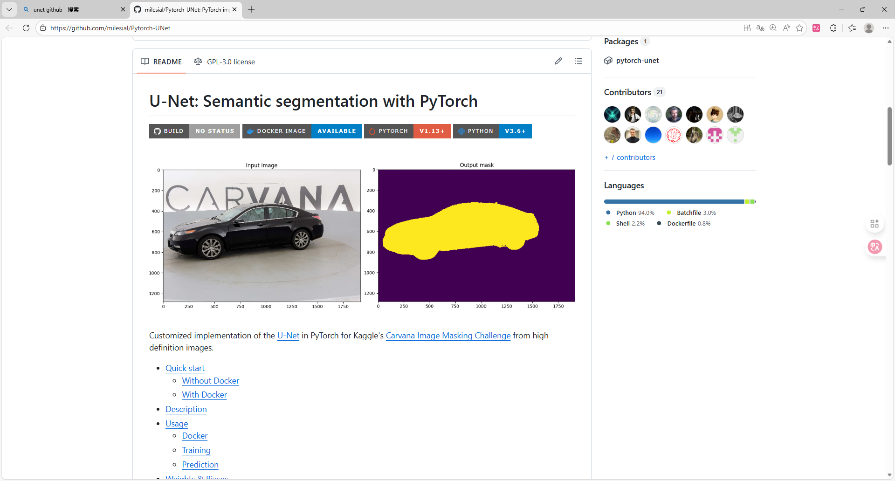
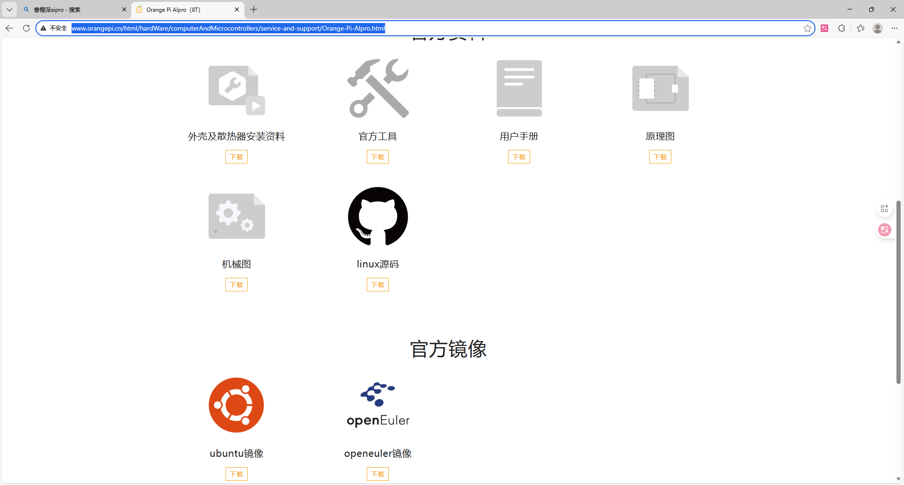
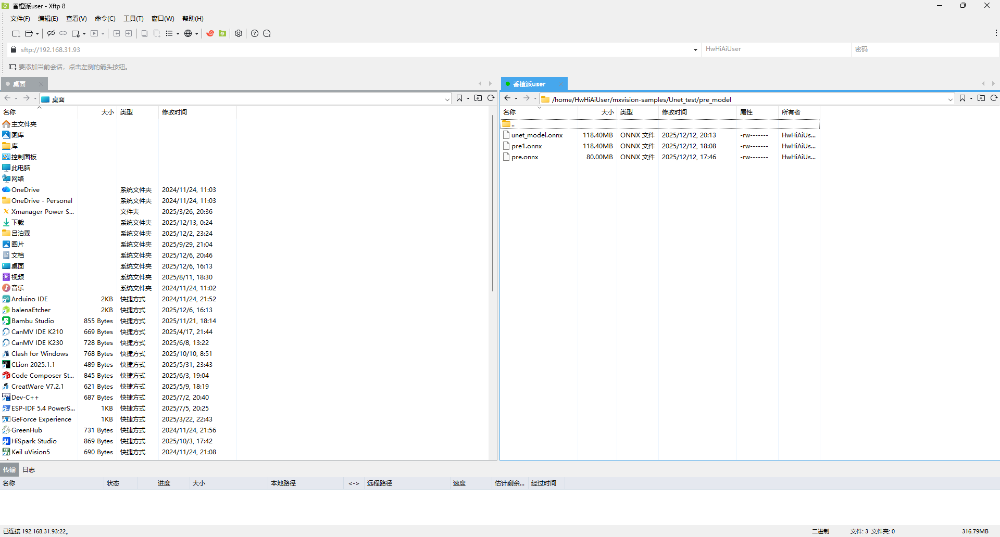
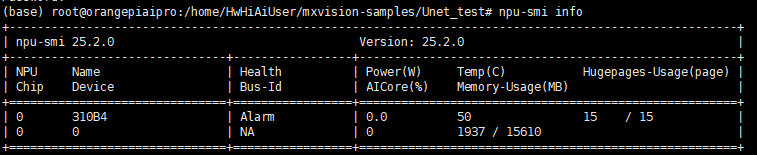
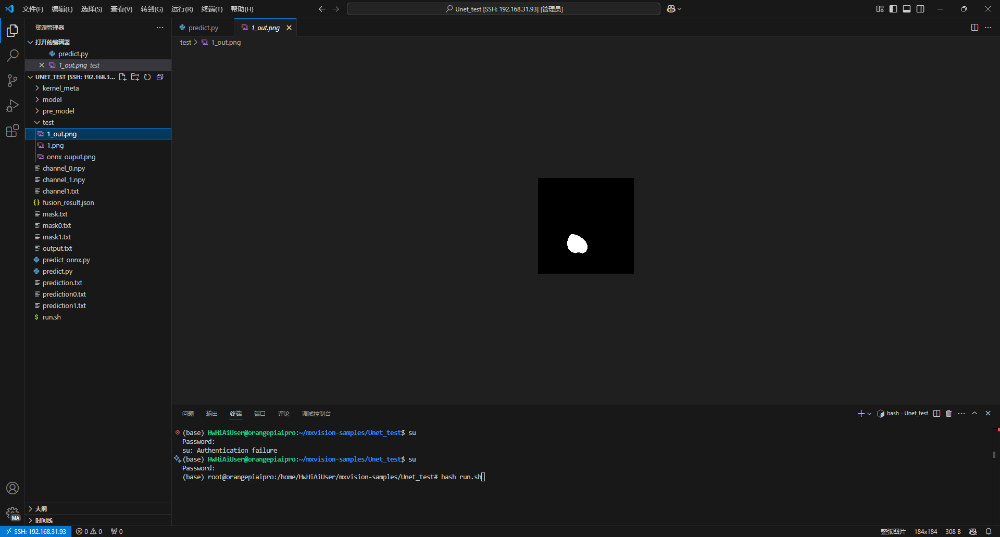
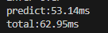
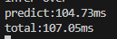
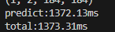

# 在香橙派(昇腾NPU)(kunpengpro/aipro)上部署自己的模型 -以Unet为例
实验室里有一块吃灰的kunpengpro开发板(16G 8tops),最近有时间尝试一下在昇腾NPU下部署自己的模型
## 1.Unet模型训练
虽然可以通过使用华为的Minspore框架直接在香橙派上训练，但是训练的还是太慢了，而且资料比较少，我们这里选择在电脑上训练好模型，之后转换为.om文件部署在香橙派上\
我们这里选择github上比较有名的Unet仓库来进行训练:https://github.com/milesial/Pytorch-UNet

由于我们的重点不在模型训练上，所以这里我们就不讲解如何使用了\
但是这个项目训练完成后的.pth文件无法直接转换，我们需要先转换为onnx文件后，才能转化为Ascend平台上的om文件进行推理,这里我们编写一个pth转onnx文件的代码
``` python
import torch
from unet import UNet

def export_to_onnx(model_path, output_path, input_shape=(3, 369, 369), device='cpu'):
    #由于.pth文件只包含权重，不包含模型结构，所以需要重新定义模型结构
    model = UNet(n_channels=3, n_classes=2, bilinear=False)  # 根据你的训练参数修改
    model.to(device)
    checkpoint = torch.load(model_path, map_location=device)
    if 'mask_values' in checkpoint:
        del checkpoint['mask_values']
    model.load_state_dict(checkpoint)
    model.eval()  # 切换到评估模式
    dummy_input = torch.randn(1, *input_shape, device=device)  # 1是batch_size
    torch.onnx.export(
        model,  # 模型实例
        dummy_input,  # 示例输入
        output_path,  # 输出文件路径
        opset_version=11,  # ONNX版本（建议11+，兼容性较好）
        do_constant_folding=True,  # 是否折叠常量
        input_names=['input'],  # 输入节点名称
        output_names=['output'],  # 输出节点名称
        dynamic_axes=None    #维度固定，减少精度算是
    )
    print(f"ONNX模型已导出至: {output_path}")
if __name__ == '__main__':
    # 配置路径和参数（根据你的实际情况修改）
    model_path = './checkpoints/checkpoint_epoch50.pth'  # 你的.pth文件路径
    output_path = 'unet_model.onnx'                    # 导出的ONNX路径
    input_shape = (3, 184, 184)                        # 输入图像尺寸（需与训练时一致，如369x369,我这里369的图片训练时缩放为184）
    device = 'cuda' if torch.cuda.is_available() else 'cpu'

    export_to_onnx(model_path, output_path, input_shape, device)

```
这样，电脑端的准备工作就做完了，接下来就可以将这个onnx模型部署到香橙派上
## 2.镜像选择
为什么我在这里会提一嘴镜像选择，是因为我刚开始使用香橙派kunkengpro的时候，使用的时官方的openEuler镜像，但是里面并没有AI相关的工具链，查找之后发现可以使用alpro的镜像，这个镜像包含了一系列相关的Ai工具链，所以我这里直接给我的kunpeng pro开发板烧录了alpro的镜像\
下载地址:http://www.orangepi.cn/html/hardWare/computerAndMicrocontrollers/service-and-support/Orange-Pi-AIpro.html\

我一般ubuntu用的多，所以我这里选择的时ubuntu镜像
## 3.模型转换
在HiHwAiUser用户下,选择mxvision-samples目录并在这里创建一个Unet_test文件夹，通过samba或者ftp将我们的onnx上传到这个目录下(我这里时创建了个pre_model目录来专门存放)

(我这里三个onnx文件是之前测试的时候上传的)
上传好模型后我们就可以使用atc指令来进行模型转换
模型转换前，我们需要查看一下NPU的型号,我这里的型号是Ascend310B4
```
npu-smi info
```

模型转换前记得输入su切换为root用户
```
atc --model=./pre_model/unet_model.onnx --framework=5 --output=./unet184 --input_format=NCHW --input_shape="input:1,3,184,184" --soc_version=Ascend310B4 
```
参数解释:\
model:输入模型地址\
framework:输出模型类型(5代表onnx)
output: om模型输出目录\
input_format:输入形状(一般固定为NCHW)\
input_shape:input是转onnx时定义的输入,1,3,184,184是训练是的图像输入形状\
soc-version:当前NPU型号\
执行这段代码一段时间后，就可以得到om文件了
## 推理代码编写
图片的预处理和后处理与使用可以参考pytorch中相关的代码，我这里使用华为的MindSDK来简化推理
### 导入相应的包
```python
import numpy as np
import matplotlib
from PIL import Image
from mindx.sdk import base
from mindx.sdk.base import Tensor
from scipy.special import expit
import time
```
### 模型预处理
``` python
def preprocess(pil_img,scale):
    w,h=pil_img.size
    newW,newH=int(scale * w), int(scale * h)
    #图片大小转换为om要求的输出大小
    pil_img = pil_img.resize((newW,newH),resample = Image.BICUBIC)
    img = np.asarray(pil_img,dtype = np.float32)
    img = img.transpose([2,0,1])#转换为NCHW
    if (img>1).any():#归一化
        img = img/255.0
    img = np.expand_dims(img, axis=0)  # 扩展第一维度，适应模型输入
    img = np.ascontiguousarray(img) #将数组转换为内存中连续存储的形式
    return img
```
这里预处理主要是讲图片转换为模型要求的输入大小并转换为numpy数组,之后转换为NCHW形式，这部分和在pytorch上类似\
需要注意的是img = np.ascontiguousarray(img)这行代码，我之前忽略了这句导致模型推理不正常，需要重点关注
### 模型推理和后处理
由于我编写的时候为测试性质，直接固定了模型和图片的位置，这部分可根据自己的需要进行修改\
由于我在训练的时候设置为2分类问题(n_classes=2)，所以这里使用argmax函数
``` python
def process():
    pic_path = 'test/1.png'
    model_path = "model/unet184.om"
    img = Image.open(pic_path)
    img = img.convert('RGB')
    img = preprocess(pil_img=img,scale=0.5)
    img = Tensor(img) #将numpy转为Tensor,方便NPU推理
    model = base.model(modelPath = model_path,deviceId = 0)#选择模型和设备
    predict_start=time.time()#记录时间
    output = model.infer([img])[0]#获取推理结果
    predict_end = time.time()
    output.to_host()#将推理结果送回CPU
    print("infer over")
    output_numpy = np.array(output)#转换为numpy数组，进行后处理
    prediction = np.argmax(output_numpy[0], axis=0)#激活处理
    if prediction.max() <= 1:
        prediction = (prediction * 255).astype(np.uint8) #图片可视化
    total_time = time.time()
    result_pic = Image.fromarray(prediction) #保存为图片
    result_pic.save('test/1_out.png')
    print(f'predict:{(predict_end-predict_start)*1000:.2f}ms')
    print(f'total:{(total_time-predict_start)*1000:.2f}ms')
```

### 主函数定义
``` python
if __name__=="__main__":
    base.mx_init() #固定使用方法
    process()
    base.mx_deinit()
```
## 函数使用
由于使用mindsdk的ascend需要定义一系列变量，所以在mxvision-samples的Resnet50文件夹下有一个run.sh，我们直接复制到Unet目录下稍作改动使用
```
path_cur=$(dirname $0)

cd $path_cur

# Set environment PATH (Please confirm that the install_path is correct).
export TE_PARALLEL_COMPILER=1
export install_path=/usr/local/Ascend/ascend-toolkit/latest
export PATH=/usr/local/python3.9.2/bin:${install_path}/atc/ccec_compiler/bin:${install_path}/atc/bin:$PATH
export PYTHONPATH=${install_path}/atc/python/site-packages:${install_path}/atc/python/site-packages/auto_tune.egg/auto_tune:${install_path}/atc/python/site-packages/schedule_search.egg
export LD_LIBRARY_PATH=${install_path}/atc/lib64:$LD_LIBRARY_PATH
export ASCEND_OPP_PATH=${install_path}/opp

soc="Ascend"
chip_version=$(npu-smi info | awk '{print $3}' | grep -m 1 310)

# Execute, transform model.
# cd model
# atc --model=resnet50.prototxt --weight=resnet50.caffemodel --framework=0 --output=resnet50 --soc_version="$soc$chip_version"
# cd ..

# Infer
python3 predict.py
exit 0
```
由于我们不需要重复执行模型转换部分 这部分代码我直接注释掉了\
在使用这个sh文件前，我们还需要执行几个环境配置，所有步骤如下
```
#记得切换为root用户!!!
source /usr/local/Ascend/ascend-toolkit/set_env.sh
source /usr/local/Ascend/mxVision-6.0.0.SPC2/set_env.sh
bash run.sh
```
这样代码就能正常运行了，我们在test文件夹下查看推理结果

推理成功
## 时间对比
由于我对npu的性能有一些好奇，所以我添加了一些时间记录函数来记录推理时间
### fp16精度

### fp32精度
想使用fp32精度推理，om转换是需要加上强制fp32推理选项
```
atc --model=./pre_model/unet_model.onnx --framework=5 --output=./unet184_fp32 --input_format=NCHW --input_shape="input:1,3,184,184" --soc_version=Ascend310B4 --precision_mode=force_fp32
```

时间长了一些
### 香橙派CPU推理
由于om模型只能运行在NPU上，我们这里是用onnx模型在CPU上进行推理(需要提前安装onnxruntime)
``` python
import onnxruntime as ort
from PIL import Image
import numpy as np
import time


def process_img(scale=0.5):
    img = Image.open('test/1.png')
    img = img.convert('RGB')
    w, h = img.size
    newW, newH = int(scale * w), int(scale * h)
    img = img.resize((newW, newH), resample=Image.BICUBIC)
    img = np.asarray(img,dtype=np.float32)
    img = img.transpose((2, 0, 1))
    if (img > 1).any():
        img = img / 255.0
    img = np.expand_dims(img,axis=0)
    return img

def predict_by_onnx(onnx_path):
    ort_session = ort.InferenceSession(onnx_path)
    input_name = ort_session.get_inputs()[0].name
    output_name = ort_session.get_outputs()[0].name
    input_data =process_img()
    predict_start=time.time()
    outputs = ort_session.run([output_name],{input_name:input_data})
    predict_end=time.time()
    output_array=outputs[0]
    print(output_array.shape)
    prediction = np.argmax(outputs[0][0], axis=0)
    if prediction.max() <= 1:
        prediction = (prediction * 255).astype(np.uint8)
    total_time=time.time()
    print(f'predict:{(predict_end-predict_start)*1000:.2f}ms')
    print(f'total:{(total_time-predict_start)*1000:.2f}ms')
    return prediction

if __name__ == "__main__":
    onnx_path = 'model/unet_model.onnx'
    result = predict_by_onnx(onnx_path)
    result_pic = Image.fromarray(result)
    result_pic.save('test/onnx_ouput.png')

```
\
可以看出来NPU加速效果还是很明显的
