前言：本次教程作为一次模型量化的练手，主要是针对算子支持不完善的情况进行。实际使用时建议只用 rknn model zoo 中支持的代码来运行，以获得更好的推理效果。

## 电脑端准备

这里的重点是把模型转换后部署到 RKNN 板子上，所以不会讲解如何训练 YOLO 模型，我们直接使用 YOLO 官方预训练好的模型 `yolov5n.pt`。

### pt 转 onnx

虽然 pt 可以直接转为 rknn 模型，但原始模型的 640×640 输入让泰山派处理还是有点费力，所以我的想法是先用 pt 模型转换一个 **320×320** 输入的 onnx 模型，方便后续转成相应的 rknn 模型。

得益于 YOLO 官方的 ultralytics 库，这部分代码可以做得非常简单，几行就能搞定（记得提前拉取相应的仓库，并安装好依赖）：

```python
from ultralytics import YOLO

# Load a model
model = YOLO("model/yolov5nu.pt")  # load an official model

# Export the model
model.export(format="onnx",opset = 19,imgsz = 320)
#opset可以选择其他版本,我这里rknn toolkit推荐opset19
```

可以使用 netron 查看转换后的输入形式，这里使用网页端查看：

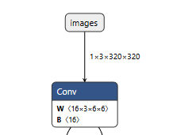

输入为 1×3×320×320，成功。

## Linux 端准备

由于 rknn 官方的转换工具只能在 x86 结构的 Linux 系统下运行，所以这部分不能在 Windows 下做了。

我这里是选择去 autodl 上租了一个 x86 架构、无 GPU 的服务器（主要是电脑空间有限，没办法再去搞虚拟机了）。如果电脑空间允许的话，推荐在自己的电脑上执行模型转换。

### rknn toolkit2 安装

为了方便，我这里在服务器上提前选择了 miniconda3，先创建一个 conda 环境：

```bash
conda activate rknn python=3.10
```

然后在这个虚拟环境下安装一些常用的包，比如 numpy、opencv、pillow 等。

在 rknn 的仓库中把整个文件夹下载下来：

<https://github.com/rockchip-linux/rknn-toolkit2>

我这里选择的是 1.6.0 版本，可根据自己的需求选择。在 rknn 环境下，进入如下目录：

```text
rknn-toolkit2/rknn-toolkit2/packages/
```

里面有如下文件：

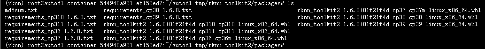

根据自己的 Python 版本选择合适的 require 依赖和 `.whl` 包。我们 Python 版本为 3.10，选择 cp310、x86 的包：

```bash
pip install rknn_toolkit2-1.6.0+81f21f4d-cp310-cp310-linux_x86_64.whl
```

### 数据集准备

在 int8 量化中，需要使用训练的数据集进行数据校准，以保证量化后推理的精度。这里我直接下载了 ultralytics 的 coco128 数据集来进行校准，使用如下代码生成 `dataset.txt`：

```python
import os

image_dir = 'train' #替换为自己的数据集路径
output_txt = 'dataset.txt'

# 获取所有图片路径并写入 txt
with open(output_txt, 'w') as f:
    for img_name in os.listdir(image_dir):
        if img_name.endswith(('.jpg', '.jpeg', '.png')):
            # 写入绝对路径
            f.write(os.path.abspath(os.path.join(image_dir, img_name)) + '\n')

print(f"校准列表已生成至: {output_txt}")
```

### onnx 转 rknn

在依赖安装就绪后，就可以执行模型转换的代码了。相应的介绍在 toolkit 文件夹中的 doc 文件下：

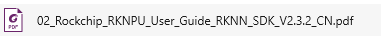

里面介绍了转换时的步骤，可以参考着写转换代码。这里给一个通用的示例：

```python
from rknn.api import RKNN
from PIL import Image
import numpy as np
import cv2
model_path = "yolov5nu.onnx"
DATASET_PATH = "dataset.txt"

def main():
    rknn = RKNN(verbose=True, verbose_file='./yolo.log')
    rknn.config(
    mean_values=[0, 0, 0], 
    std_values=[255, 255, 255],
    quant_img_RGB2BGR=False,
    target_platform='rk3566',
    quantized_method='channel')
    print('--> Loading model')
    ret = rknn.load_onnx(model=model_path)
    if ret != 0:
        print('Load model failed!')
        exit(ret)    
    print('done')
    print('--> Building model')
    ret = rknn.build(do_quantization=True, dataset=DATASET_PATH,auto_hybrid=True)
    # ret = rknn.build(do_quantization=False, dataset=DATASET_PATH)
    if ret != 0:
        print('Build model failed!')
        exit(ret)
    print('done')
    print('--> Export rknn model')
    ret = rknn.export_rknn(export_path='./yolo.rknn')
    if ret != 0:
        print('Export rknn model failed!')
        exit(ret)
    print('done')
    rknn.release()
if __name__ == "__main__":
    main()
```

除此之外 rknn 还提供了模拟工具，可以让我们直接在 x86 平台上使用模拟器进行推理，查看转换后模型的推理效果。这里我们直接放在一起，转换后直接进行模拟推理。

先写图像预处理与后处理部分，命名为 `process.py`（原文笔误为 proecees.py）：

```python
# 此代码主要是yolo图像预处理和后处理部分，命名为process.py
from PIL import Image
import numpy as np

IMG_SZ = 320  # 输入图片尺寸（export 时使用的大小）
CONF_THRES = 0.25  # 置信度阈值
IOU_THRES = 0.45  # IOU 阈值
NUM_CLASSES = 80  # 类别数

def letterbox(im, new_size=IMG_SZ, color=(114,114,114)):
    w0, h0 = im.size
    r = min(new_size / w0, new_size / h0)
    new_unpad = (int(round(w0 * r)), int(round(h0 * r)))
    im_resized = im.resize(new_unpad, Image.BILINEAR)
    new_im = Image.new("RGB", (new_size, new_size), color)
    pad_x = (new_size - new_unpad[0]) // 2
    pad_y = (new_size - new_unpad[1]) // 2
    new_im.paste(im_resized, (pad_x, pad_y))
    return new_im, r, (pad_x, pad_y)

def preprocess(img_path):
    im = Image.open(img_path).convert("RGB")
    im_resized, scale, pad = letterbox(im, IMG_SZ)
    # x = np.array(im_resized).astype(np.float32) / 255.0
    x = np.array(im_resized)
    x = x.transpose((2, 0, 1))  # 1x3xHxW
    x = np.expand_dims(x,axis=0)
    x = np.ascontiguousarray(x) #将数组转换为内存中连续存储的形式
    return im, x, scale, pad

def nms_numpy(boxes, scores, iou_threshold=0.45):
    if boxes.shape[0] == 0:
        return []
    x1 = boxes[:, 0]
    y1 = boxes[:, 1]
    x2 = boxes[:, 2]
    y2 = boxes[:, 3]
    areas = (x2 - x1) * (y2 - y1)
    order = scores.argsort()[::-1]
    keep = []
    while order.size > 0:
        i = order[0]
        keep.append(i)
        if order.size == 1:
            break
        xx1 = np.maximum(x1[i], x1[order[1:]])
        yy1 = np.maximum(y1[i], y1[order[1:]])
        xx2 = np.minimum(x2[i], x2[order[1:]])
        yy2 = np.minimum(y2[i], y2[order[1:]])
        w = np.maximum(0.0, xx2 - xx1)
        h = np.maximum(0.0, yy2 - yy1)
        inter = w * h
        iou = inter / (areas[i] + areas[order[1:]] - inter)
        inds = np.where(iou <= iou_threshold)[0]
        order = order[inds + 1]
    return keep

def parse_preds(pred, img_sz=IMG_SZ, num_classes=NUM_CLASSES):
    """
    pred: numpy array shape (1, C, N) like (1, 84, 8400)
    returns boxes (N,4) in xyxy relative to original image after letterbox undo,
            scores (N,), class_ids (N,)
    """
    
    # pred = (pred.astype(np.float32) - 0 )/ 255.0
    # 转成 (num_preds, C)
    pred = np.asarray(pred)
    if pred.ndim == 3 and pred.shape[0] == 1:
        pred = pred[0]  # (C, N)
        print("1")
    pred = pred.T  # (N, C)  e.g. (8400, 84)

    # 切分：前4=xywh, 接着 num_classes 分为 class scores
    xywh = pred[:, :4].copy()
    probs = pred[:, 4:4 + num_classes].copy()
    print(probs.max())
    print(probs.min())
    # 判断 xywh 的尺度：如果值 >1 很可能是以像素为单位（0..IMG_SZ），否则是 0..1
    mean_xy = xywh[:, :2].mean()
    normalized = mean_xy <= 1.0  # 简单判断，如果中心坐标平均 <=1 则认为是归一化

    if normalized:
        # xywh 为 0..1 相对值 -> 乘以 img_sz 得到相对于输入尺度（例如 640）
        xywh = xywh * img_sz
    # 现在 xywh 假设为相对于 IMG_SZ 的像素尺度（即 [0..IMG_SZ]）

    cx = xywh[:, 0]
    cy = xywh[:, 1]
    w = xywh[:, 2]
    h = xywh[:, 3]
    x1 = cx - w / 2
    y1 = cy - h / 2
    x2 = cx + w / 2
    y2 = cy + h / 2
    boxes = np.stack([x1, y1, x2, y2], axis=1)  # 相对于 input (IMG_SZ) 的坐标
    print(boxes)
    # class scores & ids
    scores = probs.max(axis=1)
    class_ids = probs.argmax(axis=1)

    return boxes, scores, class_ids, normalized
```

然后是转换 + 模拟推理的代码：

```python
from rknn.api import RKNN
from PIL import Image
import numpy as np
import process as pre
import cv2
model_path = "yolov5nu.onnx"
DATASET_PATH = "dataset.txt"
img_path = "output.png"

IMG_SZ = 320  # 输入图片尺寸（export 时使用的大小）
CONF_THRES = 0.25  # 置信度阈值
IOU_THRES = 0.45  # IOU 阈值
NUM_CLASSES = 80  # 类别数

def main():
    rknn = RKNN(verbose=True, verbose_file='./yolo.log')
    rknn.config(
    mean_values=[0, 0, 0], 
    std_values=[255, 255, 255], #让模型自动归一化 不需要再手动归一化，节省时间
    quant_img_RGB2BGR=False,
    target_platform='rk3566',
    quantized_method='channel')
    print('--> Loading model')
    ret = rknn.load_onnx(model=model_path)
    if ret != 0:
        print('Load model failed!')
        exit(ret)    
    print('done')
    print('--> Building model')
    ret = rknn.build(do_quantization=True, dataset=DATASET_PATH,auto_hybrid=True)
    # ret = rknn.build(do_quantization=False, dataset=DATASET_PATH)
    if ret != 0:
        print('Build model failed!')
        exit(ret)
    print('done')
    print('--> Export rknn model')
    ret = rknn.export_rknn(export_path='./yolo.rknn')
    if ret != 0:
        print('Export rknn model failed!')
        exit(ret)
    print('done')
    ret = rknn.init_runtime()
    if ret != 0:
        print('Init runtime environment failed!')
        exit(ret)
    print('done')
    orig_img, x, scale, pad = pre.preprocess(img_path)
    outs = rknn.inference(inputs=[x], data_format=['nchw'])
    pred = outs[0]
    print(pred)
    if pred is None or np.size(pred) == 0:
        print("No output from model")
        return
    boxes, scores, class_ids, normalized = pre.parse_preds(pred, img_sz=IMG_SZ, num_classes=NUM_CLASSES)
    pad_x, pad_y = pad
    # 减去 pad（pad 在 IMG_SZ 尺度下），再除以 scale（scale 是原图->IMG_SZ 的缩放因子）
    boxes[:, [0, 2]] -= pad_x
    boxes[:, [1, 3]] -= pad_y
    boxes /= scale  # 现在是相对于原始图像的像素坐标
    print(scores.max())
    print(scores.min())
    print(scores)
    print(rknn.get_output_attrs())
    # 置信度过滤
    keep_mask = scores > CONF_THRES
    boxes = boxes[keep_mask]
    scores = scores[keep_mask]
    class_ids = class_ids[keep_mask]
    
    if boxes.shape[0] == 0:
        print("No detections after confidence filtering")
        return
    keep_indices = pre.nms_numpy(boxes, scores, iou_threshold=IOU_THRES)
    boxes = boxes[keep_indices]
    scores = scores[keep_indices]
    class_ids = class_ids[keep_indices]
    boxes = boxes.astype(np.int32)
    img_cv = cv2.cvtColor(np.array(orig_img), cv2.COLOR_RGB2BGR)
    for (x1, y1, x2, y2), s, cid in zip(boxes, scores, class_ids):
        cv2.rectangle(img_cv, (x1, y1), (x2, y2), (0, 255, 0), 2)
        label = f"{cid}:{s:.2f}"
        cv2.putText(img_cv, label, (x1, max(0, y1 - 8)), cv2.FONT_HERSHEY_SIMPLEX, 0.5, (0, 255, 0), 1)
    out_file = "result_nms.jpg"
    cv2.imwrite(out_file, img_cv)
    print(f"Saved {out_file} with {len(boxes)} detections")
    rknn.release()
if __name__ == "__main__":
    main()
```

### 踩坑：int8 量化后置信度全是 0

这里出现了一个问题：`scores` 里面的所有数据都是 0。但如果我们使用**非量化**的转换，是可以出现正常推理结果的，这说明目前的问题只能出现在量化上。

我们用 netron 打开 rknn 模型的结构排查一下问题（netron 也是可以查看 rknn 结构的）：

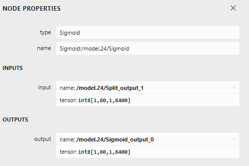

在最后的 sigmoid 函数中，发现它的输入输出**都是 int8**，估计问题就在这里：sigmoid 的输出范围是 -1~1，如果量化到 int 类型，不就全变成 0 了吗。

### 混合量化

在 rknn toolkit2 中，rknn 提供了一种**混合量化**的流程，它可以指定模型的某一部分使用 f16 量化，正好符合我们的需求——我们只需要最后输出为浮点数即可。具体步骤在 SDK 文件的混合量化章节中有讲解，可以自行查阅：

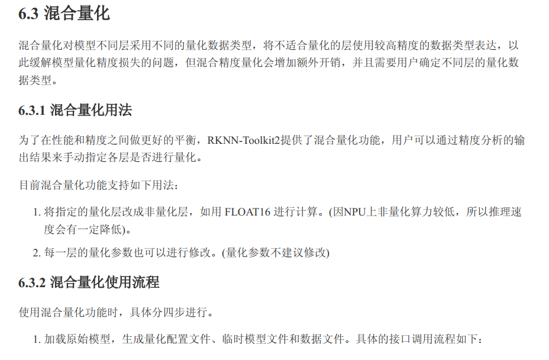

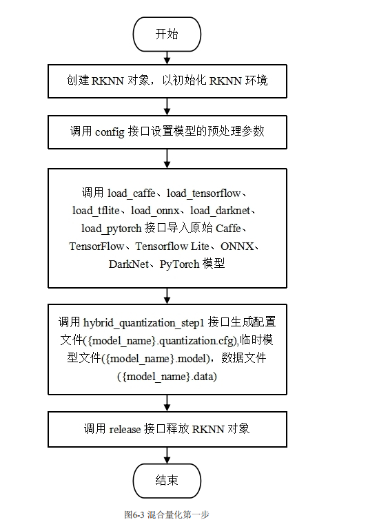

我这里是按照 SDK 的讲解和例程，编写如下代码（主要是提取出模型的结构和量化方式，命名为 `step1.py`）：

```python 
#此处代码主要是提取出模型的结构和量化方式,命名为step1.py
import numpy as np
import cv2
from rknn.api import RKNN
model_path = "yolov5nu.onnx"
DATASET_PATH = "dataset.txt"
if __name__ == '__main__':

    # Create RKNN object
    rknn = RKNN(verbose=True)
    
    # Pre-process config
    print('--> Config model')
    rknn.config(
    mean_values=[0, 0, 0], 
    std_values=[255, 255, 255],
    quant_img_RGB2BGR=False,
    target_platform='rk3566',
    quantized_method='channel')
    print('done')

    print('--> Loading model')
    ret = rknn.load_onnx(model=model_path)
    if ret != 0:
        print('Load model failed!')
        exit(ret)
    print('done')

    # Build model
    print('--> hybrid_quantization_step1')
    ret = rknn.hybrid_quantization_step1(dataset='./dataset.txt', proposal=False)
    if ret != 0:
        print('hybrid_quantization_step1 failed!')
        exit(ret)
    print('done')
    rknn.release()
```

打开生成的 `.quantization.cfg` 文件，将需要的部分转换为 float16 量化：

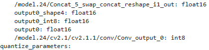

最后执行以下模型转换代码，并完成推理部分：

```python 
from rknn.api import RKNN
from PIL import Image
import numpy as np
import process as pre
import cv2
model_path = "yolov5nu.onnx"
DATASET_PATH = "dataset.txt"
img_path = "output.png"

IMG_SZ = 320  # 输入图片尺寸（export 时使用的大小）
CONF_THRES = 0.25  # 置信度阈值
IOU_THRES = 0.45  # IOU 阈值
NUM_CLASSES = 80  # 类别数

def main():
    rknn = RKNN(verbose=True, verbose_file='./yolo.log')
    ret = rknn.hybrid_quantization_step2(model_input='./yolov5int8.model',
                                         data_input='./yolov5int8.data',
                                         model_quantization_cfg='./yolov5int8.quantization.cfg')
    if ret != 0:
        print('hybrid_quantization_step2 failed!')
        exit(ret)
    print('done')
    print('--> Export rknn model')
    ret = rknn.export_rknn(export_path='./yolo.rknn')
    if ret != 0:
        print('Export rknn model failed!')
        exit(ret)
    print('done')
    ret = rknn.init_runtime()
    if ret != 0:
        print('Init runtime environment failed!')
        exit(ret)
    print('done')
    orig_img, x, scale, pad = pre.preprocess(img_path)
    outs = rknn.inference(inputs=[x], data_format=['nchw'])
    pred = outs[0]
    print(pred)
    if pred is None or np.size(pred) == 0:
        print("No output from model")
        return
    boxes, scores, class_ids, normalized = pre.parse_preds(pred, img_sz=IMG_SZ, num_classes=NUM_CLASSES)
    pad_x, pad_y = pad
    # 减去 pad（pad 在 IMG_SZ 尺度下），再除以 scale（scale 是原图->IMG_SZ 的缩放因子）
    boxes[:, [0, 2]] -= pad_x
    boxes[:, [1, 3]] -= pad_y
    boxes /= scale  # 现在是相对于原始图像的像素坐标
    print(scores.max())
    print(scores.min())
    print(scores)
    # 置信度过滤
    keep_mask = scores > CONF_THRES
    boxes = boxes[keep_mask]
    scores = scores[keep_mask]
    class_ids = class_ids[keep_mask]
    
    if boxes.shape[0] == 0:
        print("No detections after confidence filtering")
        return
    keep_indices = pre.nms_numpy(boxes, scores, iou_threshold=IOU_THRES)
    boxes = boxes[keep_indices]
    scores = scores[keep_indices]
    class_ids = class_ids[keep_indices]
    boxes = boxes.astype(np.int32)
    img_cv = cv2.cvtColor(np.array(orig_img), cv2.COLOR_RGB2BGR)
    for (x1, y1, x2, y2), s, cid in zip(boxes, scores, class_ids):
        cv2.rectangle(img_cv, (x1, y1), (x2, y2), (0, 255, 0), 2)
        label = f"{cid}:{s:.2f}"
        cv2.putText(img_cv, label, (x1, max(0, y1 - 8)), cv2.FONT_HERSHEY_SIMPLEX, 0.5, (0, 255, 0), 1)
    out_file = "result_nms.jpg"
    cv2.imwrite(out_file, img_cv)
    print(f"Saved {out_file} with {len(boxes)} detections")
    rknn.release()
if __name__ == "__main__":
    main()
```

查看推理结果：

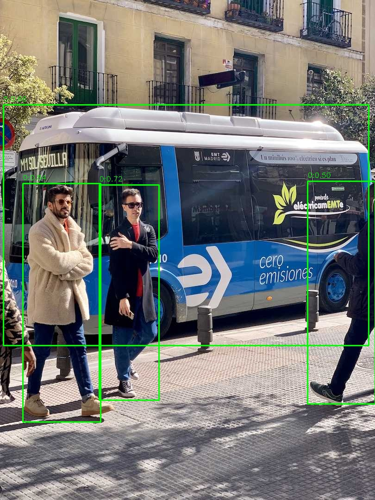

效果还是可以的。

## RK3566 部署

到此为止，我们已经成功获得了转换后的 `.rknn` 文件，接下来就可以把模型放到 RK3566 上实际部署查看效果了。

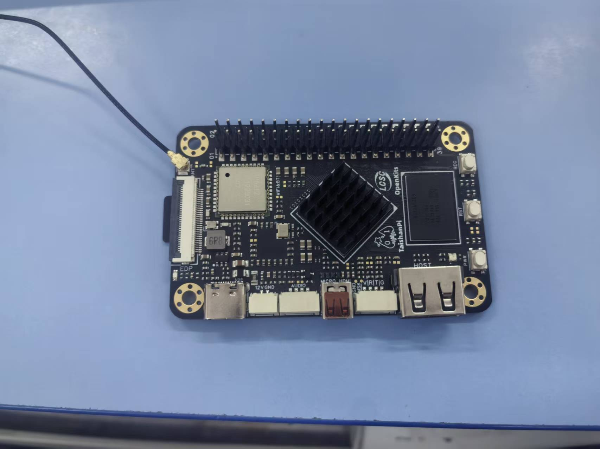

### 安装 toolkit2 lite

安装步骤与 toolkit2 类似：在泰山派上安装好 miniconda3 并创建 rknn 虚拟环境，再安装好 opencv、numpy 这些库。

从 GitHub 上拉取文件后，在 `rknn-toolkit2/rknn_toolkit_lite2/packages/` 找到相应版本的 whl 文件安装即可：

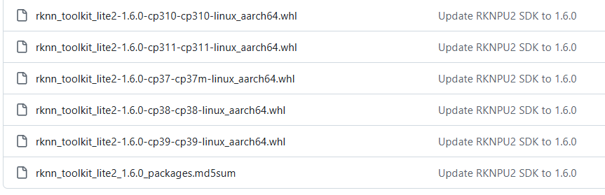

### 编写推理代码

有了之前模型转换部分的代码，这里的代码直接套用即可：

```python 
from rknnlite.api import RKNNLite
import numpy as np
from PIL import Image
import cv2
import time
RKNN_MODEL = "yolo320.rknn"  # ONNX 文件路径
IMG_PATH = "bus.jpg"  # 输入图片路径
IMG_SZ = 320  # 输入图片尺寸（export 时使用的大小）
CONF_THRES = 0.25  # 置信度阈值
IOU_THRES = 0.45  # IOU 阈值
NUM_CLASSES = 80  # 类别数

# def letterbox(im, new_size=IMG_SZ, color=(0, 0, 0)):
#     w0, h0 = im.size
#     r = min(new_size / w0, new_size / h0)
#     new_unpad = (int(round(w0 * r)), int(round(h0 * r)))
#     im_resized = im.resize(new_unpad, Image.BILINEAR)
#     new_im = Image.new("RGB", (new_size, new_size), color)
#     pad_x = (new_size - new_unpad[0]) // 2
#     pad_y = (new_size - new_unpad[1]) // 2
#     new_im.paste(im_resized, (pad_x, pad_y))
#     return new_im, r, (pad_x, pad_y)

def letterbox(im, new_size=IMG_SZ, color=(0, 0, 0)):
    h, w = im.shape[:2]
    r = min(new_size / w, new_size / h)
    new_unpad_w = int(round(w * r))
    new_unpad_h = int(round(h * r))
    im_resized = cv2.resize(im, (new_unpad_w, new_unpad_h), interpolation=cv2.INTER_LINEAR)
    new_im = np.full((new_size, new_size, 3), color, dtype=np.uint8)
    pad_x = (new_size - new_unpad_w) // 2
    pad_y = (new_size - new_unpad_h) // 2
    new_im[pad_y:pad_y+new_unpad_h, pad_x:pad_x+new_unpad_w] = im_resized
    return new_im, r, (pad_x, pad_y)

# def preprocess(img_path):
#     im = Image.open(img_path).convert("RGB")
#     im_resized, scale, pad = letterbox(im, IMG_SZ)
#     # x = np.array(im_resized).astype(np.float32) / 255.0
#     x = np.array(im_resized)
#     x = x.transpose((2, 0, 1))  # 1x3xHxW
#     x = np.expand_dims(x,axis=0)
#     x = np.ascontiguousarray(x) #将数组转换为内存中连续存储的形式
#     return im, x, scale, pad

def preprocess(img_path):
    im = cv2.imread(img_path)
    im = cv2.cvtColor(im, cv2.COLOR_BGR2RGB)
    im_resized, scale, pad = letterbox(im, IMG_SZ)
    x = im_resized.transpose((2, 0, 1))  # 变为(3, H, W)
    x = np.expand_dims(x, axis=0)  # 变为(1, 3, H, W)
    x = np.ascontiguousarray(x)
    return im, x, scale, pad

def nms_numpy(boxes, scores, iou_threshold=0.45):
    if boxes.shape[0] == 0:
        return []
    x1 = boxes[:, 0]
    y1 = boxes[:, 1]
    x2 = boxes[:, 2]
    y2 = boxes[:, 3]
    areas = (x2 - x1) * (y2 - y1)
    order = scores.argsort()[::-1]
    keep = []
    while order.size > 0:
        i = order[0]
        keep.append(i)
        if order.size == 1:
            break
        xx1 = np.maximum(x1[i], x1[order[1:]])
        yy1 = np.maximum(y1[i], y1[order[1:]])
        xx2 = np.minimum(x2[i], x2[order[1:]])
        yy2 = np.minimum(y2[i], y2[order[1:]])
        w = np.maximum(0.0, xx2 - xx1)
        h = np.maximum(0.0, yy2 - yy1)
        inter = w * h
        iou = inter / (areas[i] + areas[order[1:]] - inter)
        inds = np.where(iou <= iou_threshold)[0]
        order = order[inds + 1]
    return keep

def parse_preds(pred, img_sz=IMG_SZ, num_classes=NUM_CLASSES):
    """
    pred: numpy array shape (1, C, N) like (1, 84, 8400)
    returns boxes (N,4) in xyxy relative to original image after letterbox undo,
            scores (N,), class_ids (N,)
    """
    # 转成 (num_preds, C)
    pred = np.asarray(pred)
    if pred.ndim == 3 and pred.shape[0] == 1:
        pred = pred[0]  # (C, N)
    pred = pred.T  # (N, C)  e.g. (8400, 84)

    # 切分：前4=xywh, 接着 num_classes 分为 class scores
    xywh = pred[:, :4].copy()
    probs = pred[:, 4:4 + num_classes].copy()

    # 判断 xywh 的尺度：如果值 >1 很可能是以像素为单位（0..IMG_SZ），否则是 0..1
    mean_xy = xywh[:, :2].mean()
    normalized = mean_xy <= 1.0  # 简单判断，如果中心坐标平均 <=1 则认为是归一化

    if normalized:
        # xywh 为 0..1 相对值 -> 乘以 img_sz 得到相对于输入尺度（例如 640）
        xywh = xywh * img_sz
    # 现在 xywh 假设为相对于 IMG_SZ 的像素尺度（即 [0..IMG_SZ]）

    cx = xywh[:, 0]
    cy = xywh[:, 1]
    w = xywh[:, 2]
    h = xywh[:, 3]
    x1 = cx - w / 2
    y1 = cy - h / 2
    x2 = cx + w / 2
    y2 = cy + h / 2
    boxes = np.stack([x1, y1, x2, y2], axis=1)  # 相对于 input (IMG_SZ) 的坐标

    # class scores & ids
    scores = probs.max(axis=1)
    class_ids = probs.argmax(axis=1)

    return boxes, scores, class_ids, normalized

def main(onnx_path=RKNN_MODEL, img_path=IMG_PATH):
    rknn_lite = RKNNLite()
    ret = rknn_lite.load_rknn(RKNN_MODEL)
    if ret != 0:
        print('Load RKNN model failed')
        exit(ret)
    print('done1')
    ret = rknn_lite.init_runtime()
    if ret != 0:
        print('Init runtime environment failed')
        exit(ret)
    print('done2')
    pre_start = time.time()
    orig_img, x, scale, pad = preprocess(img_path)
    pre_end = time.time()
    infer_start = time.time()
    outs = rknn_lite.inference(inputs=[x],data_format = ["nchw"])
    infer_end = time.time()

    pro_start =  time.time()
    pred = outs[0]
    if pred is None or np.size(pred) == 0:
        print("No output from model")
        return

    boxes, scores, class_ids, normalized = parse_preds(pred, img_sz=IMG_SZ, num_classes=NUM_CLASSES)
    # 说明：此处 boxes 是相对于 IMG_SZ（例如 640）的坐标，需要减去 letterbox 的 pad 并除以 scale 恢复到原图像素
    pad_x, pad_y = pad
    # 减去 pad（pad 在 IMG_SZ 尺度下），再除以 scale（scale 是原图->IMG_SZ 的缩放因子）
    boxes[:, [0, 2]] -= pad_x
    boxes[:, [1, 3]] -= pad_y
    boxes /= scale  # 现在是相对于原始图像的像素坐标
    # 置信度过滤
    keep_mask = scores > CONF_THRES
    boxes = boxes[keep_mask]
    scores = scores[keep_mask]
    class_ids = class_ids[keep_mask]
    # boxes = boxes[0]
    # scores = scores[0]
    # class_ids = class_ids[0]

    if boxes.shape[0] == 0:
        print("No detections after confidence filtering")
        return

    # NMS
    keep_indices = nms_numpy(boxes, scores, iou_threshold=IOU_THRES)
    boxes = boxes[keep_indices]
    scores = scores[keep_indices]
    class_ids = class_ids[keep_indices]

    boxes = boxes.astype(np.int32)
    pro_end =  time.time()
    # 可视化并保存
    img_cv = cv2.cvtColor(np.array(orig_img), cv2.COLOR_RGB2BGR)
    for (x1, y1, x2, y2), s, cid in zip(boxes, scores, class_ids):
        cv2.rectangle(img_cv, (x1, y1), (x2, y2), (0, 255, 0), 2)
        label = f"{cid}:{s:.2f}"
        cv2.putText(img_cv, label, (x1, max(0, y1 - 8)), cv2.FONT_HERSHEY_SIMPLEX, 0.5, (0, 255, 0), 1)

    total_time = time.time()
    out_file = "result_nms.jpg"
    cv2.imwrite(out_file, img_cv)
    print(f"Saved {out_file} with {len(boxes)} detections")
    print(f"pre:{1000 * (pre_end-pre_start ):.2f}ms")
    print(f"Inference time: {1000 * (infer_end - infer_start):.2f} ms")
    print(f"pro time: {1000 * (pro_end - pro_start):.2f} ms")
    print(f"total time: {1000 * (pro_end-pre_start):.2f} ms")
    rknn_lite.release()

if __name__ == "__main__":
    main()
```

查看运行效果以及推理时间：

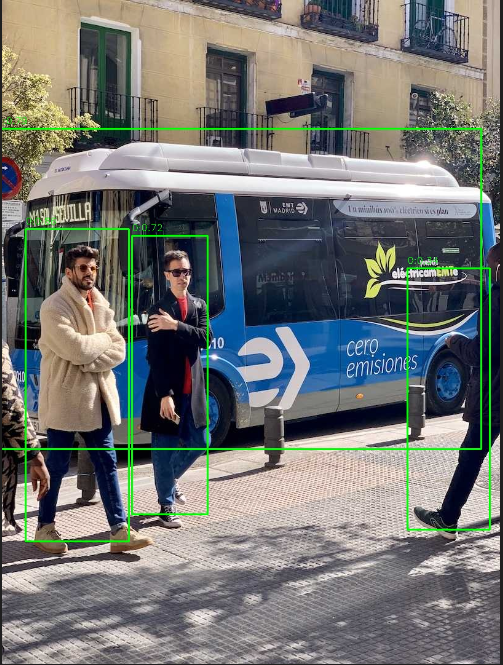

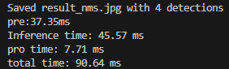

320×320 输入下，预处理 37.35 ms、推理 45.57 ms、后处理 7.71 ms，单帧总计约 90.64 ms，应该是够用了。

## 小结

整个过程可以概括为四步：

1. **pt → onnx**：用 ultralytics 把 `yolov5n.pt` 导出成 320×320 输入的 onnx（opset 19）；
2. **onnx → rknn**：在 x86 Linux 上用 RKNN-Toolkit2 做 int8 量化，注意 `target_platform='rk3566'`、`quantized_method='channel'`；
3. **踩坑与混合量化**：int8 量化后 sigmoid 的输出被压成 int8，置信度全是 0；用 `hybrid_quantization_step1/step2` 把输出相关的层改成 float16 即可恢复；
4. **上板部署**：在泰山派上装 `rknn_toolkit_lite2`，用 `RKNNLite` 跑推理。

再次提醒：这只是量化练手，实际项目建议优先使用 rknn model zoo 中已验证支持的模型与代码，推理效果和稳定性会更有保障。
